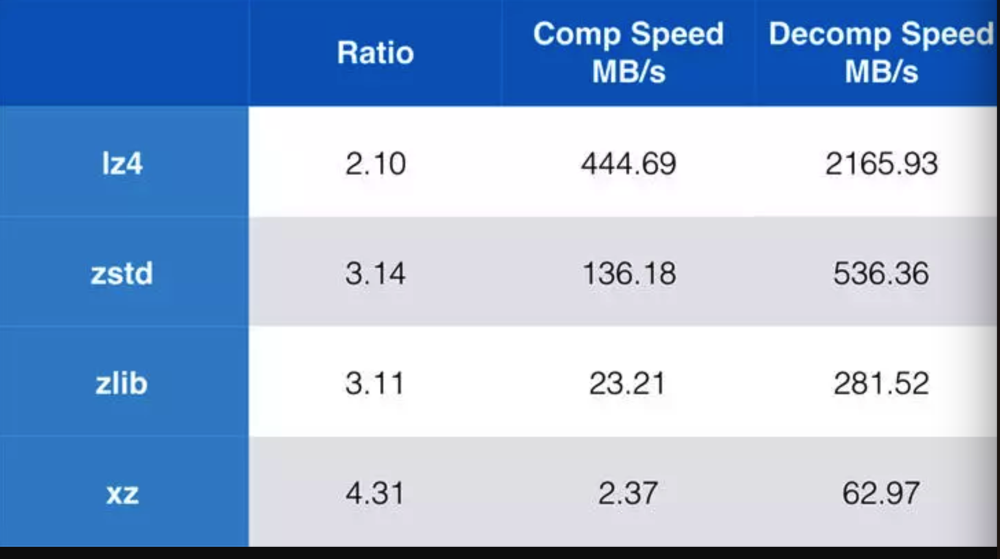

# Compression in ClickHouse

[Compression in ClickHouse](https://www.altinity.com/blog/2017/11/21/compression-in-clickhouse),  原文在*`2017/11/21`* 发表

`ClickHouse` 支持2种压缩方法（算法）， 默认 `L24`, 可以用相关配置指定：
  - `LZ4`
  - `ZSTD`

[基于`Mysql`压缩算法测试报告](https://www.percona.com/blog/2016/04/13/evaluating-database-compression-methods-update/)

结论： 简而言之，LZ4在速度上会更快，但是压缩率较低，ZSTD正好相反。尽管ZSTD比LZ4慢，但是相比传统的压缩方式Zlib，无论是在压缩效率还是速度上，都可以作为Zlib的替代品。

- 基于 `ClickHouse` 的测试：
  - table `lineorder` [**结构和数据**](https://www.altinity.com/blog/2017/6/16/clickhouse-in-a-general-analytical-workload-based-on-star-schema-benchmark)
  - 未压缩数据集 `680G`
  - 压缩数据能力测试结果：
    - `LZ4` `184G/680G`（`27%`)
    - `ZSTD` `135G/680G`（`20%`)
    - 压缩比 `LZ4/ZSTD`: `3.7/5.0`
  - 性能测试：
    - `SQL`:
      - `SELECT toYear(LO_ORDERDATE) AS yod, sum(LO_REVENUE) FROM lineorder GROUP BY yod;` 没有 `where`,`order by` 等操作。 
    - 冷数据：
      - 两者区别不大，时间主要消耗在`I/O`,远大于解压缩的时间
    - 热数据(已缓存)：
      - 热数据请求下，`LZ4`会更快，此时`IO`代价小，数据解压缩成为性能瓶颈。消耗时间上两者比率： `9/16`, 快了差不多2倍
  - 结论：
    - 大范围扫描的查询，瓶颈是`I/O`， 首选 `ZSTD`。
    - 当`I/O`快时，`LZ4`为首选
    - 具体选择什么，看具体场景和需求。 

- `ClickHouse` 压缩算法配置：
```xml
    <compression incl="clickhouse_compression">
            <case>
                    <method>zstd</method>
            </case>
    </compression>
```


## `LZ4` 算法
- `LZ4`
  - 开源后， 安卓，`Apple`,`python`,`clickhouse` 都有支持
  - `Format`
    - `[token]literals(offset,match_length)[token](offset,match length)...`
      - `Literals`指没有重复、首次出现的字节流，即不可压缩的部分
      - `Match`指重复项，可以压缩的部分
      - `Token`记录literal长度，match长度。作为解压时候memcpy的参数
```
input：abcde_bcdefgh_abcdefghxxxxxxx
output：abcde_(5,4)fgh_(14,5)fghxxxxxxx
```

## `ZSTD` 算法
- `ZSTD`
  - 在2016年由`facebook` 开源的无损压缩算法。
  - 压缩率和压缩/解压缩性能都很突出
  - 支持训练方式生成字典。
  - 开源后， `Linux` 内核/`HTTP` 协议/`hadoop 3`/ `Hbase 2`/`spark2.3+`/`kafka 2.10` 都加入对`ZSTD`的支持 
  
- 性能
  - 对大数据量的文本压缩场景，zstd是综合考虑压缩率和压缩性能最优的选择，其次是lz4。
  - 对小数据量的压缩场景，如果能使用zstd的字典方式，压缩效果更为突出。




