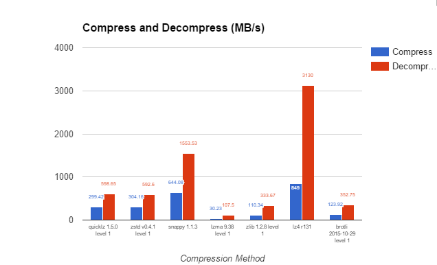
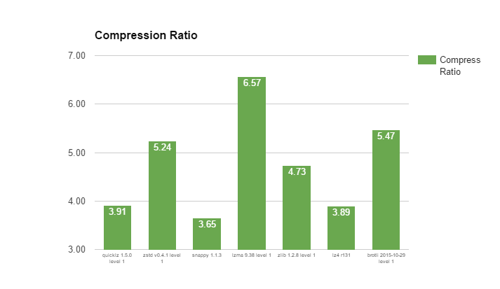
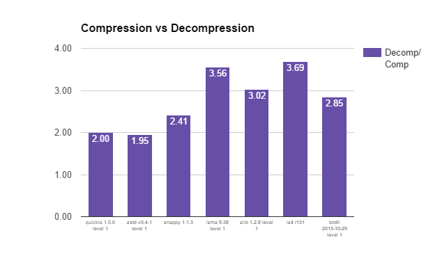

压缩算法测试报告： 
[压缩算法测试原文](https://www.percona.com/blog/2016/04/13/evaluating-database-compression-methods-update/)

这篇博客文章是对[我们上](https://www.percona.com/blog/2016/03/09/evaluating-database-compression-methods/)一篇文章的更新，其中[讨论了数据库压缩方法](https://www.percona.com/blog/2016/03/09/evaluating-database-compression-methods/)，以及它们如何相互叠加。

当我和 Vadim  上个月撰写有关[评估数据库压缩方法的文章时](https://www.percona.com/blog/2016/03/09/evaluating-database-compression-methods/)，我们声称如今评估数据库压缩算法很容易，因为有现成的基准测试套件，例如[lzbench](https://github.com/inikep/lzbench)。

就像使用该工具进行评估一样容易，发现错误也很容易。由于基准测试中的错误，我们获得了 LZ4 压缩算法的错误结果，因此在原始文章中提出了一些错误的主张和观察。非常感谢[Yann Collet](http://fastcompression.blogspot.com/)报告此问题！

在这篇文章中，我们将重申并纠正在上一篇文章中不正确的重要观察和建议。您可以在[本文档中](https://docs.google.com/spreadsheets/d/1385RUevHgwYEnhL7wUaVAYPej5wvg9WPlq1Zm8usNqU/edit#gid=2094062265)查看完整更新的结果。

从上面可以看到，压缩性能几乎没有变化。LZ4 仍然是最快的，尽管在解决问题后却没有那么快。

压缩率是我们的结果发生重大变化的地方。我们报告的 LZ4 压缩比仅为 1.89，是我们比较的压缩引擎中最低的。实际上，经过我们的校正，该比率为 3.89，比 Snappy 好，并且与 QuickLZ 相当（同时也具有更好的性能）。

就获得的压缩率与所用的 CPU 而言，LZ4 是出色的引擎。

现在，压缩与解压缩曲线图显示 LZ4 在我们研究的压缩引擎的压缩和解压缩性能之间具有最高比率。

压缩速度不受 LZ4 块大小的明显影响，因此非常适合压缩大型和小型对象。达到的最高压缩速度是使用 64KB 的块大小-不是最高的大小，但不是测试的大小中最小的大小。

通过增加块大小，我们看到了对压缩率的一些积极影响，但是，将块大小增加到 64K 以上并不能显着改善压缩率，因此 64K 成为 LZ4 的理想块，它具有最佳的压缩速度，并且压缩率约为-按需压缩。64K 块大小也适用于其他数据，尽管我们不能说它的通用性。

压缩速度与压缩比的散点图

**更新建议**

我们的大多数建议仍然是在审查更新后的结果之后做出的，只有一项重要更改。如果您正在寻找具有适当压缩率的快速压缩算法，请考虑使用 LZ4。至少在我们测试的数据集上，它提供了更好的性能以及更好的压缩率。

