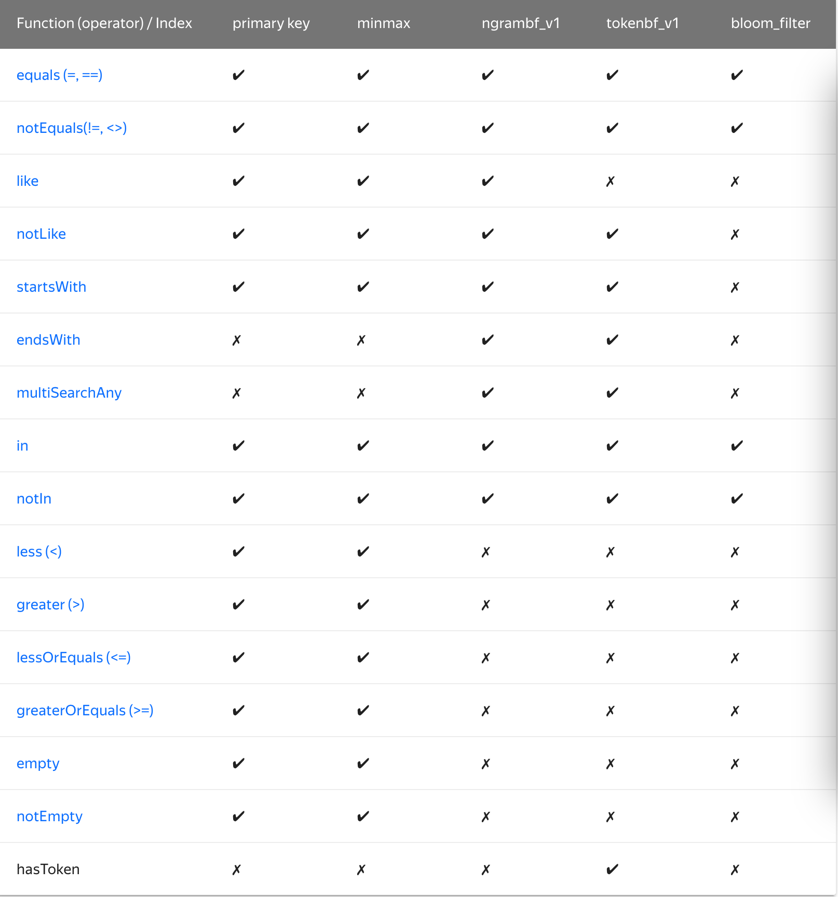

## `Table engines`

`table engines`（即表的类型）决定了：

- 数据的存储方式和位置，写到哪里以及从哪里读取数据
- 支持哪些`Query`以及如何支持。
- 并发数据访问。
- 索引的使用（如果存在）。
- 是否可以执行多线程请求。
- `Data replication`参数。

## Engine Families

### MergeTree

适用于高负载任务的最通用和功能最强大的`table engines`。这些引擎的共同特点是可以快速插入数据并进行后续的后台数据处理。 MergeTree 系列引擎支持`data replication`的引擎版本），`partition`和一些其他引擎不支持的其他功能。

该类型的引擎： 
- `MergeTree`
- `ReplacingMergeTree`
- `SummingMergeTree`
- `AggregatingMergeTree`
- `CollapsingMergeTree`
- `VersionedCollapsingMergeTree`
- `GraphiteMergeTree`

### `Log`

- 具有最小功能的`Lightweight engines`。
- 适合快速写入小表（最多约 `100万` 行）并在以后整体读取它们时，该类型的引擎是最有效的。
                                                                         
该类型的引擎：

- `TinyLog`
- `StripeLog`
- `Log`

### `Intergation engines`

用于与其他的数据存储与处理系统集成的引擎。 该类型的引擎：

- `Kafka`
- `MySQL`
- `ODBC`
- `JDBC`
- `HDFS`

### `Special engines`

该类型的引擎：

- `Distributed`
- `MaterializedView`
- `Dictionary`
- `Merge`
- `File`
- `Null`
- `Set`
- `Join`
- `URL`
- `View`
- `Memory`
- `Buffer`

## Virtual columns
- `Virtual column`: 
  - `table engines` 组成的一部分
    - 源代码定义
  - `read only`
  - 不在  `CREATE TABLE` 指定
  - 不会在下列场景结果中：
    - `SHOW CREATE TABLE`
    - `DESCRIBE TABLE`
  - 必须指定`virtual column`名称才能查询其中的数据
  - 若建表时指定的列名和虚拟列名冲突，虚拟列将不再提供查询功能。
  - 虚拟列一般以 `_` 开头

## MergeTree

- `MergeTree` 系列
  - `ClickHouse` 最强大的 `table engines`。
  - 巨量数据批量写入，按规则合并。
  - 表数据按`primary key` 排序(小稀疏索引)， 利于快速检索数据
  - 支持分区，加快检索速度。
  - 支持数据副本(`ReplicatedMergeTree`)
  - 可以给表数据指定采样方法

### Creating a Table

```
CREATE TABLE [IF NOT EXISTS] [db.]table_name [ON CLUSTER cluster]
(
    name1 [type1] [DEFAULT|MATERIALIZED|ALIAS expr1] [TTL expr1],
    name2 [type2] [DEFAULT|MATERIALIZED|ALIAS expr2] [TTL expr2],
    ...
    INDEX index_name1 expr1 TYPE type1(...) GRANULARITY value1,
    INDEX index_name2 expr2 TYPE type2(...) GRANULARITY value2
) ENGINE = MergeTree()
[PARTITION BY expr]
[ORDER BY expr]
[PRIMARY KEY expr]
[SAMPLE BY expr]
[TTL expr]
[SETTINGS name=value, ...]
```

**Query Clauses**

- `ENGINE`: 引擎名和参数。 `ENGINE = MergeTree()`. `MergeTree`  引擎没有参数。

- `PARTITION BY`: 分区键
  - `Month`:  `toYYYYMM(date_column)`
    - `data_column`： Date 类型的列

- `ORDER BY` : 表的`sort key`。
  - 列元组或任意的表达式。
    - `ORDER BY (CounterID, EventDate)`

- `PRIMARY KEY`: `primary key`
  - 默认情况下 `primary key` 跟`sort key`（由  `ORDER BY`  子句指定）相同。 
  - 因此，大部分情况下不需要再专门指定一个  `PRIMARY KEY`  子句。

- `SAMPLE BY`
  - 抽样， `primary key` 中必须包含这个表达式。
    - 例如： `SAMPLE BY intHash32(UserID) ORDER BY (CounterID, EventDate, intHash32(UserID))` 。

- `SETTINGS`: 影响  `MergeTree`  性能的额外参数：
  - `index_granularity`:索引粒度。
    - 即索引中相邻『标记』间的数据行数。
    - 默认值，8192 。
    - 该列表中所有可用的参数可以从这里查看  [MergeTreeSettings.h](https://github.com/ClickHouse/ClickHouse/blob/master/dbms/src/Storages/MergeTree/MergeTreeSettings.h) 。
  - `index_granularity_bytes`: 数据粒度以 `byte` 为单位的最大大小。
    - 默认值：`10Mb`。
    - 要仅按行数限制颗粒大小，请设置0（不建议）。请参阅`Data Storage`。
  - `enable_mixed_granularity_parts`: 启用或禁用使用该 `index_granularity_bytes` 设置控制颗粒尺寸。
    - 在版本19.11之前，只有 `index_granularity` 粒度限制的设置。
    - `index_granularity_bytes` 从具有大行（数十和数百MB）的表中选择数据时，此设置可提高 `ClickHouse` 性能。因此，如果您的表具有较大的行，则可以打开表的设置以提高 `SELECT` 查询效率。
  - `use_minimalistic_part_header_in_zookeeper`: 数据`parts`头在 `ZooKeeper` 中的存储方式。
    - `use_minimalistic_part_header_in_zookeeper=1` ，·ZooKeeper· 会存储更少的数据。
    - 更多信息参考『服务配置参数』,请看运维相关知识 。
  - `min_merge_bytes_to_use_direct_io` ： 使用 `direct I/O` 来操作`disk`的合并操作时要求的最小数据量。
    - 合并数据`parts`时，`ClickHouse` 会计算要被合并的所有数据的总存储空间。
    - 如果大小超过了  `min_merge_bytes_to_use_direct_io`  设置的字节数，则 `ClickHouse` 将使用直接 I/O 接口（`O_DIRECT`  选项）对`disk`读写。
    - 如果设置  `min_merge_bytes_to_use_direct_io = 0` ，则会禁用 `direct I/O`。
    - 默认值：`10 * 1024 * 1024 * 1024`  bytes(`10G`)。
  - `merge_with_ttl_timeout`: 重复与TTL合并之前的最小延迟（以秒为单位）。
    - 默认值：86400（1天）。
  - `write_final_mark`: 启用或禁用在数据部分的末尾写入最终索引标记。
    - 默认值：1  (不要关闭此标记)

**示例配置**

```
ENGINE MergeTree() PARTITION BY toYYYYMM(EventDate) ORDER BY (CounterID, EventDate, intHash32(UserID)) SAMPLE BY intHash32(UserID) SETTINGS index_granularity=8192
```

- 同时我们设置了一个按用户 ID 哈希的抽样表达式。
- 这让你可以有该表中每个  `CounterID`  和  `EventDate`  下面的数据的伪随机分布。
- 如果你在查询时指定了  `SAMPLE` 子句。
- `ClickHouse` 会返回对于用户子集的一个均匀的伪随机数据采样。
- `index_granularity`  可省略，默认值为 `8192` 。

### Data Storage

- 表由按 `primary key` 排序的数据  *`parts`*  组成
- 当数据被插入到表中时，会分成数据`parts`并按 `primary key` 的字典序排序
- 合并相同 `partition` 数据到 `parts`
  - 不会合并来自不同 `partition` 的数据`parts`
  - 相同`PK`的数据可能在不同的`parts`
- ClickHouse 会为每个数据 `part` 创建一个索引文件(.idx)，索引文件包含每个索引行（『标记』）的 `primary key` 值。
  - 索引行号定义为  `n * index_granularity` 。
  - 最大的  `n`  等于总行数除以  `index_granularity`  的值的整数部分。
  - 对于每列，跟 `primary key` 相同的索引行处也会写入『标记』。这些『标记』让你可以直接找到数据所在的列。
- 颗粒的大小受表引擎的 `index_granularity` 和 `index_granularity_bytes` 设置限制。
  - 颗粒中的行数在此 `[1, index_granularity]` 范围内，具体取决于行的大小。
  - `index_granularity_bytes` 如果单行的大小大于设置的值，则颗粒的大小可能会超过。在这种情况下，颗粒的大小等于行的大小。

###  Primary keys and indexes in queries

我们以  `(CounterID, Date)`  以 `primary key` 。排序好的索引的图示会是下面这样：

```
Whole data:     [-------------------------------------------------------------------------]
CounterID:      [aaaaaaaaaaaaaaaaaabbbbcdeeeeeeeeeeeeefgggggggghhhhhhhhhiiiiiiiiikllllllll]
Date:           [1111111222222233331233211111222222333211111112122222223111112223311122333]
Marks:           |      |      |      |      |      |      |      |      |      |      |
                a,1    a,2    a,3    b,3    e,2    e,3    g,1    h,2    i,1    i,3    l,3
Marks numbers:   0      1      2      3      4      5      6      7      8      9      10
```

如果指定查询如下：

- `CounterID in ('a', 'h')`，服务器会读取标记号在  `[0, 3)`  和  `[6, 8)`  区间中的数据。
- `CounterID in ('a', 'h') AND Date = 3`，服务器会读取标记号在  `[1, 3)`  和  `[7, 8)`  区间中的数据。
- `Date = 3`，服务器会读取标记号在  `[1, 10]`  区间中的数据。

使用 `index` 比全表`Scan` 更高效。


- 稀疏索引
  - 引起额外的数据读取。
    - 当读取 `primary key` 单个 `range` 范围的数据时，每个 `data block` 中最多会多读  `index_granularity * 2`  行额外的数据。
    - 大部分情况下，当  `index_granularity = 8192`  时，`ClickHouse` 的性能并不会降级。
    - 能操作有巨量行的表。
      - 因为这些索引是常驻内存（RAM）的。

- `ClickHouse` 不要求 `primary key` 惟一。所以，你可以插入多条具有相同 `primary key` 的行。

####  Selecting the Primary Key

 `primary key` 中列的数量并没有明确的限制。依据数据结构，你应该让 `primary key` 包含多些或少些列。这样可以：

- 改善索引的性能。

  如果当前 `primary key` 是  `(a, b)` ，然后加入另一个  `c`  列，满足下面条件时，则可以改善性能：
  - 有带有  `c`  列条件的查询。 
  - 表经常有数倍于 `index_granularity` 设置值的  `(a, b)`  都是相同的值。

- 改善数据压缩。

  - `ClickHouse` 以 `primary key` 排序`parts`数据
    - 数据的一致性越高，压缩越好。

- `CollapsingMergeTree` 和  `SummingMergeTree` 引擎里，数据合并时，会有额外的处理逻辑。

  在这种情况下，指定一个跟 `primary key` 不同的  *sort by*  也是有意义的。

长的 `primary key` 会对插入性能和内存消耗有负面影响，但 `primary key` 中额外的列并不影响  `SELECT`  查询的性能。

#### Choosing a Primary Key that Differs from the Sorting Key

与`sort key`不同的`primary key`。 
  - `primary key` 表达式元组必须是`sort key`表达式元组的一个前缀。
  - 当使用下列引擎时，这样的设置非常有价值：
     - `SummingMergeTree`
     -`AggregatingMergeTree`
     - `Sort key` 经常频繁更新
     - `primary key` 中仅预留少量列保证高效范围扫描

- `sort key`的修改是轻量级
  - 因为新列同时被加入到表和`sort key`后时，已存在的数据`parts`并不需要修改。
  - 由于旧的`sort key`是新`sort key`的前缀，并且刚刚添加的列中没有数据，因此在表修改时的数据对于新旧的`sort key`来说都是有序的。

#### Use of indexes and Partitions in Queries

对于  `SELECT`  查询，是否可以使用索引:
  
- 如果  `WHERE/PREWHERE`  子句有下面这些表达式（作为谓词链接一子项或整个）则可以使用索引：
    - 基于 `primary key` 或分区键的列或表达式:
      - 部分的等式或比较运算表达式；
      - 固定前缀的  `IN`  或  `LIKE`  表达式；

    - 基于 `primary key` 或分区键的列:
      - 函数；

    - 基于 `primary key` 或分区键的表达式:
      - 逻辑表达式。

当引擎配置如下时：

```
ENGINE MergeTree() PARTITION BY toYYYYMM(EventDate) ORDER BY (CounterID, EventDate) SETTINGS index_granularity=8192
```

这种情况下，这些查询：

```sql
SELECT count() FROM table WHERE EventDate = toDate(now()) AND CounterID = 34
SELECT count() FROM table WHERE EventDate = toDate(now()) AND (CounterID = 34 OR CounterID = 42)
SELECT count() FROM table WHERE ((EventDate >= toDate('2014-01-01') AND EventDate <= toDate('2014-01-31')) OR EventDate = toDate('2014-05-01')) AND CounterID IN (101500, 731962, 160656) AND (CounterID = 101500 OR EventDate != toDate('2014-05-01'))
```

ClickHouse 会依据 `primary key` 索引剪掉不符合的数据，依据按月分区的分区键剪掉那些不包含符合数据的分区。

上文的查询显示，即使索引用于复杂表达式。因为读表操作是组织好的，所以，使用索引不会比完整扫描慢。

下面这个例子中，不会使用索引。

```sql
SELECT count() FROM table WHERE CounterID = 34 OR URL LIKE '%upyachka%'
```

要检查 ClickHouse 执行一个查询时能否使用索引，可设置  `force_index_by_date` 和  `force_primary_key`, 运维部分。

按月分区的分区键是只能读取包含适当范围日期的数据块。这种情况下，数据块会包含很多天（最多整月）的数据。
- 在块中，数据按 `primary key` 排序， `primary key` 第一列可能不包含日期。
- 因此，仅使用日期而没有带 `primary key` 前缀条件的查询将会导致读取超过这个日期范围。

#### Use of Index for Partially-Monotonic Primary Keys
例如，考虑一个月中的几天。它们形成一个月的[`monotonic sequence`](https://en.wikipedia.org/wiki/Monotonic_function)，但在更长的时间内不单调。这是部分单调的序列。如果用户使用部分单调的主键创建表，则ClickHouse将照常创建稀疏索引。当用户从这种表中选择数据时，`ClickHouse` 将分析查询条件。如果用户希望在索引的两个标记之间获取数据并且这两个标记均在一个月之内，则ClickHouse可以在这种特殊情况下使用索引，因为它可以计算查询参数与索引标记之间的距离。

如果查询参数范围内主键的值不表示`monotonic sequence`，则 `ClickHouse` 无法使用索引。在这种情况下，`ClickHouse` 使用完整扫描方法。

`ClickHouse` 不仅在每月的某几天序列中使用此逻辑，而且还在表示部分 `monotonic sequence` 的任何主键中使用此逻辑。

#### Data Skipping Indexes (Experimental)

需要设置  `allow_experimental_data_skipping_indices`  为 1 才能使用此索引。（执行  `SET allow_experimental_data_skipping_indices = 1`）。

此索引在  `CREATE`  语句的列部分里定义。

```
INDEX index_name expr TYPE type(...) GRANULARITY granularity_value
```

`*MergeTree` 系列的表都能指定跳数索引。

这些索引是由数据块按粒度分割后的每部分在指定表达式上汇总信息  `granularity_value`  组成（粒度大小用`table engines`里  `index_granularity`  的指定）。 

这些汇总信息有助于用 `where` 语句跳过大片不满足的数据，从而减少 `SELECT` 查询从`disk`读取的数据量

**Example**

```sql
CREATE TABLE table_name
(
    u64 UInt64,
    i32 Int32,
    s String,
    ...
    INDEX a (u64 * i32, s) TYPE minmax GRANULARITY 3,
    INDEX b (u64 * length(s)) TYPE set(1000) GRANULARITY 4
) ENGINE = MergeTree()
...
```

上例中的索引能让 ClickHouse 执行下面这些查询时减少读取数据量。

```sql
SELECT count() FROM table WHERE s < 'z'
SELECT count() FROM table WHERE u64 * i32 == 10 AND u64 * length(s) >= 1234
```

**Available Types of indices**

- `minmax`  存储指定表达式的极值（如果表达式是  `tuple` ，则存储  `tuple`  中每个元素的极值），这些信息用于跳过数据块，类似 `primary key` 。

- `set(max_rows)`  存储指定表达式的惟一值（不超过  `max_rows`  个，`max_rows=0`  则表示『无限制』）。这些信息可用于检查  `WHERE`  表达式是否满足某个数据块。

- `ngrambf_v1(n, size_of_bloom_filter_in_bytes, number_of_hash_functions, random_seed)`  
  - 存储包含数据块中所有 n 元短语的  [`Bloom filter`](https://en.wikipedia.org/wiki/Bloom_filter) 。
  - 只可用在字符串上。 可用于优化  `equals` ， `like`  和  `in`  表达式的性能。 
    
    - `n` : 短语长度。 
    - `size_of_bloom_filter_in_bytes`: `Bloom filter`大小，单位字节。（因为压缩得好，可以指定比较大的值，如 `256` 或 `512`）。
    -  `number_of_hash_functions` : `Bloom filter` 中使用的 hash 函数的个数。
    -  `random_seed` : hash 函数的随机种子。

- `tokenbf_v1(size_of_bloom_filter_in_bytes, number_of_hash_functions, random_seed)`  
  - 跟  `ngrambf_v1`  类似，它只存储被非字母数据字符分割的`parts`。

- `bloom_filter([false_positive])`
  - 为指定的列存储 `Bloom filter`。
  - 可选 `false_positive` 参数是从过滤器接收到错误肯定响应的可能性。可能的值：`（0，1）`。默认值：`0.025`。
  
  - 支持的数据类型：
    - `Int*`
    - `UInt*`
    - `Float*`
    - `Enum`
    - `Date`
    - `DateTime`
    - `String`
    - `FixedString`
    - `Array`
    - `LowCardinality`
    - `Nullable`
  
  以下函数可以使用它：`equals`，`notEquals`，`in`，`notIn`和`has`。
  
```sql
INDEX sample_index (u64 * length(s)) TYPE minmax GRANULARITY 4
INDEX sample_index2 (u64 * length(str), i32 + f64 * 100, date, str) TYPE set(100) GRANULARITY 4
INDEX sample_index3 (lower(str), str) TYPE ngrambf_v1(3, 256, 2, 0) GRANULARITY 4
```

**Functions Support**

`WHERE`子句中的条件包含使用列操作的函数的调用。如果列是索引的一部分，则 `ClickHouse` 在执行功能时会尝试使用此索引。`ClickHouse` 支持使用索引的功能的不同子集。

该set索引可以与所有函数一起使用。下表显示了其他索引的功能子集。



常量参数小于`ngram`大小的函数不能使用`ngrambf_v1`查询优化。

`Bloom Filter`可以有 `false positive` 匹配，所以 当函数预期为 `false` 时，`ngrambf_v1`，`tokenbf_v1` 和 `bloom_filter` 索引不能用于优化查询，例如：

- `Can be optimized`：
 - s LIKE '%test%'
 - NOT s NOT LIKE '%test%'
 - s = 1
 - NOT s != 1
 - startsWith(s, 'test')

- `Can't be optimized`：
  - NOT s LIKE '%test%'
  - s NOT LIKE '%test%'
  - NOT s = 1
  - s != 1
  - NOT startsWith(s, 'test')

### Concurrent Data Access

应对表的并发访问，我们使用多版本机制。换言之，当同时读和更新表时，数据从当前查询到的一组`parts`中读取。没有冗长的的锁。插入不会阻碍读取。

对表的读操作是自动并行的。

### TTL for Columns and Tables

确定`value`的`lifetime`。

可以为整个表和每个单独的列设置 `TTL` 从句。如果同时设置了两种 `TTL`，则 `ClickHouse` 将使用更早时间的`TTL`配置。

该表必须在 `Date` 或 `DateTime` 数据类型的列上定义数据的生存期。如：

```
TTL time_column
TTL time_column + interval
```

需要使用 `time interval` 操作，定义 `interval`:

```
TTL date_time + INTERVAL 1 MONTH
TTL date_time + INTERVAL 15 HOUR
```

*Column TTL**

当列中的值过期时，`ClickHouse` 会将其替换为列数据类型的默认值。如果数据部分中的所有列值均已过期，则 ClickHouse 将从文件系统中的数据部分删除此列。

该`TTL`子句不能用于`key column`。

例子：

用 TTL 创建表

```sql
CREATE TABLE example_table 
(
    d DateTime,
    a Int TTL d + INTERVAL 1 MONTH,
    b Int TTL d + INTERVAL 1 MONTH,
    c String
)
ENGINE = MergeTree
PARTITION BY toYYYYMM(d)
ORDER BY d;
```

将 TTL 添加到现有表的列中

```sql
ALTER TABLE example_table
    MODIFY COLUMN
    c String TTL d + INTERVAL 1 DAY;
```

更改列的 TTL

```sql
ALTER TABLE example_table
    MODIFY COLUMN
    c String TTL d + INTERVAL 1 MONTH;
```

**Table TTL**

当 `table` 中的数据过期时，`ClickHouse` 会删除所有对应的行。

例子：

用 TTL 创建表

```sql
CREATE TABLE example_table 
(
    d DateTime,
    a Int
)
ENGINE = MergeTree
PARTITION BY toYYYYMM(d)
ORDER BY d
TTL d + INTERVAL 1 MONTH;
```

改变表的 TTL

```sql
CREATE TABLE example_table 
(
    d DateTime,
    a Int
)
ENGINE = MergeTree
PARTITION BY toYYYYMM(d)
ORDER BY d
TTL d + INTERVAL 1 MONTH;
```

**Removing Data**

- 当 `ClickHouse` 合并数据部分时，将删除 TTL 过期的数据。

- 数据已过期时，它将执行 `off-shedule` 合并。
  - 要控制此类合并的频率，可以设置 `merge_with_ttl_timeout`(运维部分)。
  - 如果该值太低，它将执行许多 `off-schedule` 合并，这可能会消耗大量资源。

如果`SELECT`在合并之间执行查询，则可能会获得过期的数据。为了避免这种情况，请在之前使用[OPTIMIZE](https://clickhouse.yandex/docs/en/query_language/misc/#misc_operations-optimize)查询`SELECT`。

## Using multiple block devices for data storage

### **General**

`MergeTree` 系列的表能够将其数据存储在多个块设备上.
- 例如，当某个表的数据隐式拆分为 `hot` 和 `cold` 时，这可能会很有用。
  - 定期请求最新数据，但只需要少量空间。
  - 相反，很少要求提供详尽的历史数据。如果有多个`disk`可用，则 `hot` 数据可能位于快速`disk`（NVMe SSD 甚至是内存）中，而 `cold` 数据可能位于相对较慢的`disk`（HDD）上。

- `part` 是 `MergeTree` 表的最小可移动单位。
  - 在后台的`disk`之间（根据用户设置)
  - 通过 `ALTER` 查询来移动部件。 

### **Terms**

-`Disk`: 挂载到文件系统的块设备。
- `Default disk`-包含在 `<path>` 标签中指定的路径的`disk`config.xml`。
- `Volume`: 一组相等的有序`disk`（类似于[JBOD](https://en.wikipedia.org/wiki/Non-RAID_drive_architectures)）。
- `Storage policy`-许多 `Volume` 以及在它们之间移动数据的规则。

可以在系统表, [system.storage_policies](https://clickhouse.yandex/docs/en/operations/system_tables/#system_tables-storage_policies)和[system.disks](https://clickhouse.yandex/docs/en/operations/system_tables/#system_tables-disks)找到提供给所描述实体的名称。可以将 `storage policy` 名称用作 `MergeTree` 系列表的参数。

### Configuration

`Disk`, `Volume` 和 `Storage policy` 应在 `main` 文件中`config.xml`或`config.d`目录中不同文件的标记`<storage_configuration>`内声明。配置文件中的此部分具有以下结构：

```xml
<disks>
    <fast_disk> <!-- disk name -->
        <path>/mnt/fast_ssd/clickhouse</path>
    </fast_disk>
    <disk1>
        <path>/mnt/hdd1/clickhouse</path>
        <keep_free_space_bytes>10485760</keep_free_space_bytes>_
    </disk1>
    <disk2>
        <path>/mnt/hdd2/clickhouse</path>
        <keep_free_space_bytes>10485760</keep_free_space_bytes>_
    </disk2>

    ...
</disks>
```

- `disk`名称作为标记名称给出。e.g. `fast_disk` 为 `disk`的名称
- `path`: 服务器将用来存储数据（`data`和`shadow`文件夹）的路径应以 '/' 结尾。
- `keep_free_space_bytes` —要保留的可用`disk`空间量。

`disk`定义的顺序并不重要。

 `storage policy`配置：

```xml
<policies>
    <hdd_in_order> <!-- policy name -->
        <volumes>
            <single> <!-- volume name -->
                <disk>disk1</disk>
                <disk>disk2</disk>
            </single>
        </volumes>
    </hdd_in_order>

    <moving_from_ssd_to_hdd>
        <volumes>
            <hot>
                <disk>fast_ssd</disk>
                <max_data_part_size_bytes>1073741824</max_data_part_size_bytes>
            </hot>
            <cold>
                <disk>disk1</disk>
            </cold>            
        </volumes>
        <move_factor>0.2</move_factor>
    </moving_from_ssd_to_hdd>
</policies>
```

- `volume` 和 `storage policy` 名称以标签名称形式给出。
- `disk` : `volume` 中的`disk`。
- `max_data_part_size_bytes` —可以存储在任何 `volume` 的 `disk` 上的部件的最大大小。
- `move_factor` —当可用空间量小于该因子时，数据将自动开始在下一个`volume`（如果有）上移动（默认值为 `0.1`）。

在给定的示例中，该`hdd_in_order`策略实现了[循环](https://en.wikipedia.org/wiki/Round-robin_scheduling)方法。由于该策略仅定义一个`volume`（`single`），因此数据以循环顺序存储在其所有`disk`上。如果有多个类似的`disk`安装到系统，则此策略将非常有用。如果有不同的`disk`，则`moving_from_ssd_to_hdd`可以使用该策略。该`volume`hot`由一个 SSD `disk`（`fast_ssd`）组成，该`volume`上可以存储的部件的最大大小为 1GB。所有大小大于 1GB 的部件将直接存储在`cold`包含 HDD `disk`的`volume`上`disk1`。同样，一旦`disk`的`fast_ssd`容量超过 80％，数据将`disk1`通过后台进程传输。

 `storage policy`中`volume`枚举的顺序很重要。一旦一个`volume`被过度填充，数据将移至下一个。`disk`枚举的顺序也很重要，因为数据是依次存储在`disk`上的。

创建表时，可以将配置的 `storage policy` 之一应用于表：

```sql
CREATE TABLE table_with_non_default_policy (
    EventDate Date,
    OrderID UInt64,
    BannerID UInt64,
    SearchPhrase String
) ENGINE = MergeTree
ORDER BY (OrderID, BannerID)
PARTITION BY toYYYYMM(EventDate)
SETTINGS storage_policy = 'moving_from_ssd_to_hdd'
```

该`default` `storage policy`意味着使用只有一个`volume`，其中仅由一个在给定的`disk`<path>`。创建表后，将无法更改其 `storage policy`。

### Details

对于 `MergeTree` 表，数据以不同的方式进入`disk`：

- 作为插入（`INSERT` 查询）的结果。
- 在后台合并和`mutation` (见 `Sql Reference/ALTER/Mutations` 部分) 过程中。[官方地址](https://clickhouse.yandex/docs/en/query_language/alter/#alter-mutations)。
- 从另一个副本下载时。
- 由于 `partition freezing` 而导致(见 `sql reference/ALTER/FREEZE PARTITION` ) [][ALTER TABLE ... FREEZE PARTITION](https://clickhouse.yandex/docs/en/query_language/alter/#alter_freeze-partition)。

在所有这些情况下，除了`mutation`和`partition frozen`外，根据给定的 `storage policy`，一部分存储在`volume`和`disk`上：

1.  选择具有足够`disk`空间来存储部件（`unreserved_space > current_part_size`）并允许存储给定大小（`max_data_part_size_bytes > current_part_size`）的部件的第一个`volume`（按定义顺序）。
2.  在该`volume`中，选择该`disk`之后的`disk`，该`disk`用于存储先前的数据块，并且其可用空间大于部件大小（`unreserved_space - keep_free_space_bytes > current_part_size`）。

在幕后，`mutations` 和 `partition frozen` 利用[`hard links`](https://en.wikipedia.org/wiki/Hard_link)。不支持不同`disk`之间的`hard links`，因此在这种情况下，生成的 `parts` 与初始`disk`存储在同一`disk`上。

在后台，`part` 被`volume`之间的自由空间（的量的基础上移动`move_factor`参数）根据`volume`在配置文件中声明的顺序。数据永远不会从最后一个传输到第一个。可以使用系统表[system.part_log](https://clickhouse.yandex/docs/en/operations/system_tables/#system_tables-part-log)（字段`type = MOVE_PART`）和[system.parts](https://clickhouse.yandex/docs/en/operations/system_tables/#system_tables-parts)（字段`path`和`disk`）来监视后台移动。同样，可以在服务器日志中找到详细信息。

用户可以使用查询[ALTER TABLE ... MOVE PART | PARTITION ... TO VOLUME | DISK ...](https://clickhouse.yandex/docs/en/query_language/alter/#alter_move-partition)来强制将一`parts`或`partition`从一个`volume`移动到另一个`volume`，所有对后台操作的限制都已考虑在内。该查询将自行启动移动，而无需等待后台操作完成。如果没有足够的可用空间或不满足任何要求的条件，用户将收到错误消息。

移动数据不会干扰数据复制。因此，可以为不同副本上的同一表指定不同的 `storage policy`。

后台合并和`mutation`完成后，仅在一定时间（`old_parts_lifetime`）后才删除旧`parts`。在此期间，它们不会移至其他`volume`或`disk`。因此，在最终删除这些`part`之前，仍要考虑它们以评估占用的`disk`空间。


## 数据副本[¶](https://clickhouse.yandex/docs/zh/single/#table_engines-replication "Permanent link")

只有 MergeTree 系列里的表可支持副本：

- ReplicatedMergeTree
- ReplicatedSummingMergeTree
- ReplicatedReplacingMergeTree
- ReplicatedAggregatingMergeTree
- ReplicatedCollapsingMergeTree
- ReplicatedVersionedCollapsingMergeTree
- ReplicatedGraphiteMergeTree

副本是表级别的，不是整个服务器级的。所以，服务器里可以同时有复制表和非复制表。

副本不依赖分片。每个分片有它自己的独立副本。

对于  `INSERT`  和  `ALTER`  语句操作数据的会在压缩的情况下被复制（更多信息，看  [ALTER](https://clickhouse.yandex/docs/zh/single/#query_language_queries_alter) ）。

而  `CREATE`，`DROP`，`ATTACH`，`DETACH`  和  `RENAME`  语句只会在单个服务器上执行，不会被复制。

- `The CREATE TABLE`  在运行此语句的服务器上创建一个新的可复制表。如果此表已存在其他服务器上，则给该表添加新副本。
- `The DROP TABLE`  删除运行此查询的服务器上的副本。
- `The RENAME`  重命名一个副本。换句话说，可复制表不同的副本可以有不同的名称。

要使用副本，需在配置文件中设置 ZooKeeper 集群的地址。例如：

<zookeeper>
    <node index="1">
        <host>example1</host>
        <port>2181</port>
    </node>
    <node index="2">
        <host>example2</host>
        <port>2181</port>
    </node>
    <node index="3">
        <host>example3</host>
        <port>2181</port>
    </node>
</zookeeper>

需要 ZooKeeper 3.4.5 或更高版本。

你可以配置任何现有的 ZooKeeper 集群，系统会使用里面的目录来存取元数据（该目录在创建可复制表时指定）。

如果配置文件中没有设置 ZooKeeper ，则无法创建复制表，并且任何现有的复制表都将变为只读。

`SELECT`  查询并不需要借助 ZooKeeper ，复本并不影响  `SELECT`  的性能，查询复制表与非复制表速度是一样的。查询分布式表时，ClickHouse 的处理方式可通过设置  [max_replica_delay_for_distributed_queries](https://clickhouse.yandex/docs/zh/single/#settings-max_replica_delay_for_distributed_queries)  和  [fallback_to_stale_replicas_for_distributed_queries](https://clickhouse.yandex/docs/zh/single/#../settings/settings/)  修改。

对于每个  `INSERT`  语句，会通过几个事务将十来个记录添加到 ZooKeeper。（确切地说，这是针对每个插入的数据块; 每个 INSERT 语句的每  `max_insert_block_size = 1048576`  行和最后剩余的都各算作一个块。）相比非复制表，写 zk 会导致  `INSERT`  的延迟略长一些。但只要你按照建议每秒不超过一个  `INSERT`  地批量插入数据，不会有任何问题。一个 ZooKeeper 集群能给整个 ClickHouse 集群支撑协调每秒几百个  `INSERT`。数据插入的吞吐量（每秒的行数）可以跟不用复制的数据一样高。

对于非常大的集群，你可以把不同的 ZooKeeper 集群用于不同的分片。然而，即使 Yandex.Metrica 集群（大约 300 台服务器）也证明还不需要这么做。

复制是多主异步。 `INSERT`  语句（以及  `ALTER` ）可以发给任意可用的服务器。数据会先插入到执行该语句的服务器上，然后被复制到其他服务器。由于它是异步的，在其他副本上最近插入的数据会有一些延迟。如果部分副本不可用，则数据在其可用时再写入。副本可用的情况下，则延迟时长是通过网络传输压缩数据块所需的时间。

默认情况下，INSERT 语句仅等待一个副本写入成功后返回。如果数据只成功写入一个副本后该副本所在的服务器不再存在，则存储的数据会丢失。要启用数据写入多个副本才确认返回，使用  `insert_quorum`  选项。

单个数据块写入是原子的。 INSERT 的数据按每块最多  `max_insert_block_size = 1048576`  行进行分块，换句话说，如果  `INSERT`  插入的行少于 1048576，则该 INSERT 是原子的。

数据块会去重。对于被多次写的相同数据块（大小相同且具有相同顺序的相同行的数据块），该块仅会写入一次。这样设计的原因是万一在网络故障时客户端应用程序不知道数据是否成功写入 DB，此时可以简单地重复  `INSERT` 。把相同的数据发送给多个副本 INSERT 并不会有问题。因为这些  `INSERT`  是完全相同的（会被去重）。去重参数参看服务器设置  [merge_tree](https://clickhouse.yandex/docs/zh/single/#../server_settings/settings/) 。（注意：Replicated\*MergeTree 才会去重，不需要 zookeeper 的不带 MergeTree 不会去重）

在复制期间，只有要插入的源数据通过网络传输。进一步的数据转换（合并）会在所有副本上以相同的方式进行处理执行。这样可以最大限度地减少网络使用，这意味着即使副本在不同的数据中心，数据同步也能工作良好。（能在不同数据中心中的同步数据是副本机制的主要目标。）

你可以给数据做任意多的副本。Yandex.Metrica 在生产中使用双副本。某一些情况下，给每台服务器都使用 RAID-5 或 RAID-6 和 RAID-10。是一种相对可靠和方便的解决方案。

系统会监视副本数据同步情况，并能在发生故障后恢复。故障转移是自动的（对于小的数据差异）或半自动的（当数据差异很大时，这可能意味是有配置错误）。

### 创建复制表[¶](https://clickhouse.yandex/docs/zh/single/#creating-replicated-tables "Permanent link")

在`table engines`名称上加上  `Replicated`  前缀。例如：`ReplicatedMergeTree`。

**Replicated\*MergeTree 参数**

- `zoo_path` — ZooKeeper 中该表的路径。
- `replica_name` — ZooKeeper 中的该表的副本名称。

示例:

CREATE TABLE table_name
(
EventDate DateTime,
CounterID UInt32,
UserID UInt32
) ENGINE = ReplicatedMergeTree('/clickhouse/tables/{layer}-{shard}/table_name', '{replica}')
PARTITION BY toYYYYMM(EventDate)
ORDER BY (CounterID, EventDate, intHash32(UserID))
SAMPLE BY intHash32(UserID)

已弃用的建表语法示例：

CREATE TABLE table_name
(
EventDate DateTime,
CounterID UInt32,
UserID UInt32
) ENGINE = ReplicatedMergeTree('/clickhouse/tables/{layer}-{shard}/table_name', '{replica}', EventDate, intHash32(UserID), (CounterID, EventDate, intHash32(UserID), EventTime), 8192)

如上例所示，这些参数可以包含宏替换的占位符，即大括号的部分。它们会被替换为配置文件里 'macros' 那部分配置的值。示例：

<macros>
    <layer>05</layer>
    <shard>02</shard>
    <replica>example05-02-1.yandex.ru</replica>
</macros>

“ZooKeeper 中该表的路径”对每个可复制表都要是唯一的。不同分片上的表要有不同的路径。 这种情况下，路径包含下面这些部分：

`/clickhouse/tables/`  是公共前缀，我们推荐使用这个。

`{layer}-{shard}`  是分片标识部分。在此示例中，由于 Yandex.Metrica 集群使用了两级分片，所以它是由两部分组成的。但对于大多数情况来说，你只需保留 {shard} 占位符即可，它会替换展开为分片标识。

`table_name`  是该表在 ZooKeeper 中的名称。使其与 ClickHouse 中的表名相同比较好。 这里它被明确定义，跟 ClickHouse 表名不一样，它并不会被 RENAME 语句修改。  
_HINT_: you could add a database name in front of `table_name` as well. E.g. `db_name.table_name`

副本名称用于标识同一个表分片的不同副本。你可以使用服务器名称，如上例所示。同个分片中不同副本的副本名称要唯一。

你也可以显式指定这些参数，而不是使用宏替换。对于测试和配置小型集群这可能会很方便。但是，这种情况下，则不能使用分布式 DDL 语句（`ON CLUSTER`）。

使用大型集群时，我们建议使用宏替换，因为它可以降低出错的可能性。

在每个副本服务器上运行  `CREATE TABLE`  查询。将创建新的复制表，或给现有表添加新副本。

如果其他副本上已包含了某些数据，在表上添加新副本，则在运行语句后，数据会从其他副本复制到新副本。换句话说，新副本会与其他副本同步。

要删除副本，使用  `DROP TABLE`。但它只删除那个 – 位于运行该语句的服务器上的副本。

### 故障恢复[¶](https://clickhouse.yandex/docs/zh/single/#gu-zhang-hui-fu "Permanent link")

如果服务器启动时 ZooKeeper 不可用，则复制表会切换为只读模式。系统会定期尝试去连接 ZooKeeper。

如果在  `INSERT`  期间 ZooKeeper 不可用，或者在与 ZooKeeper 交互时发生错误，则抛出异常。

连接到 ZooKeeper 后，系统会检查本地文件系统中的数据集是否与预期的数据集（ ZooKeeper 存储此信息）一致。如果存在轻微的不一致，系统会通过与副本同步数据来解决。

如果系统检测到损坏的数据`parts`（文件大小错误）或无法识别的`parts`（写入文件系统但未记录在 ZooKeeper 中的部分），则会把它们移动到 'detached' 子目录（不会删除）。而副本中其他任何缺少的但正常数据`parts`都会被复制同步。

注意，ClickHouse 不会执行任何破坏性操作，例如自动删除大量数据。

当服务器启动（或与 ZooKeeper 建立新会话）时，它只检查所有文件的数量和大小。 如果文件大小一致但中间某处已有字节被修改过，不会立即被检测到，只有在尝试读取  `SELECT`  查询的数据时才会检测到。该查询会引发校验和不匹配或压缩块大小不一致的异常。这种情况下，数据`parts`会添加到验证队列中，并在必要时从其他副本中复制。

如果本地数据集与预期数据的差异太大，则会触发安全机制。服务器在日志中记录此内容并拒绝启动。这种情况很可能是配置错误，例如，一个分片上的副本意外配置为别的分片上的副本。然而，此机制的阈值设置得相当低，在正常故障恢复期间可能会出现这种情况。在这种情况下，数据恢复则是半自动模式，通过用户主动操作触发。

要触发启动恢复，可在 ZooKeeper 中创建节点  `/path_to_table/replica_name/flags/force_restore_data`，节点值可以是任何内容，或运行命令来恢复所有的可复制表：

sudo -u clickhouse touch /var/lib/clickhouse/flags/force_restore_data

然后重启服务器。启动时，服务器会删除这些标志并开始恢复。

### 在数据完全丢失后的恢复[¶](https://clickhouse.yandex/docs/zh/single/#zai-shu-ju-wan-quan-diu-shi-hou-de-hui-fu "Permanent link")

如果其中一个服务器的所有数据和元数据都消失了，请按照以下步骤进行恢复：

1.  在服务器上安装 ClickHouse。在包含分片标识符和副本的配置文件中正确定义宏配置，如果有用到的话，
2.  如果服务器上有非复制表则必须手动复制，可以从副本服务器上（在  `/var/lib/clickhouse/data/db_name/table_name/`  目录中）复制它们的数据。
3.  从副本服务器上中复制位于  `/var/lib/clickhouse/metadata/`  中的表定义信息。如果在表定义信息中显式指定了分片或副本标识符，请更正它以使其对应于该副本。（另外，启动服务器，然后会在  `/var/lib/clickhouse/metadata/`  中的.sql 文件中生成所有的  `ATTACH TABLE`  语句。） 4.要开始恢复，ZooKeeper 中创建节点  `/path_to_table/replica_name/flags/force_restore_data`，节点内容不限，或运行命令来恢复所有复制的表：`sudo -u clickhouse touch /var/lib/clickhouse/flags/force_restore_data`

然后启动服务器（如果它已运行则重启）。数据会从副本中下载。

另一种恢复方式是从 ZooKeeper（`/path_to_table/replica_name`）中删除有数据丢的副本的所有元信息，然后再按照“[创建可复制表](https://clickhouse.yandex/docs/zh/single/#creating-replicated-tables)”中的描述重新创建副本。

恢复期间的网络带宽没有限制。特别注意这一点，尤其是要一次恢复很多副本。

### MergeTree 转换为 ReplicatedMergeTree[¶](https://clickhouse.yandex/docs/zh/single/#mergetree-zhuan-huan-wei-replicatedmergetree "Permanent link")

我们使用  `MergeTree`  来表示  `MergeTree系列`  中的所有`table engines`，`ReplicatedMergeTree`  同理。

如果你有一个手动同步的  `MergeTree`  表，您可以将其转换为可复制表。如果你已经在  `MergeTree`  表中收集了大量数据，并且现在要启用复制，则可以执行这些操作。

如果各个副本上的数据不一致，则首先对其进行同步，或者除保留的一个副本外，删除其他所有副本上的数据。

重命名现有的 MergeTree 表，然后使用旧名称创建  `ReplicatedMergeTree`  表。 将数据从旧表移动到新表（`/var/lib/clickhouse/data/db_name/table_name/`）目录内的 'detached' 目录中。 然后在其中一个副本上运行`ALTER TABLE ATTACH PARTITION`，将这些数据`parts`添加到工作集中。

### ReplicatedMergeTree 转换为 MergeTree[¶](https://clickhouse.yandex/docs/zh/single/#replicatedmergetree-zhuan-huan-wei-mergetree "Permanent link")

使用其他名称创建 MergeTree 表。将具有`ReplicatedMergeTree`表数据的目录中的所有数据移动到新表的数据目录中。然后删除`ReplicatedMergeTree`表并重新启动服务器。

如果你想在不启动服务器的情况下清除  `ReplicatedMergeTree`  表：

- 删除元数据目录中的相应  `.sql`  文件（`/var/lib/clickhouse/metadata/`）。
- 删除 ZooKeeper 中的相应路径（`/path_to_table/replica_name`）。

之后，你可以启动服务器，创建一个  `MergeTree`  表，将数据移动到其目录，然后重新启动服务器。

### 当 ZooKeeper 集群中的元数据丢失或损坏时恢复方法[¶](https://clickhouse.yandex/docs/zh/single/#dang-zookeeper-ji-qun-zhong-de-yuan-shu-ju-diu-shi-huo-sun-pi-shi-hui-fu-fang-fa "Permanent link")

如果 ZooKeeper 中的数据丢失或损坏，如上所述，你可以通过将数据转移到非复制表来保存数据。

## 自定义分区键[¶](https://clickhouse.yandex/docs/zh/single/#zi-ding-yi-fen-qu-jian "Permanent link")

[MergeTree](https://clickhouse.yandex/docs/zh/single/#mergetree/)  系列的表（包括  [可复制表](https://clickhouse.yandex/docs/zh/single/#replication/) ）可以使用分区。基于 MergeTree 表的  [物化视图](https://clickhouse.yandex/docs/zh/single/#materializedview/)  也支持分区。

一个分区是指按指定规则逻辑组合一起的表的记录集。可以按任意标准进行分区，如按月，按日或按事件类型。为了减少需要操作的数据，每个分区都是分开存储的。访问数据时，ClickHouse 尽量使用这些分区的最小子集。

分区是在  [建表](https://clickhouse.yandex/docs/zh/single/#table_engine-mergetree-creating-a-table)  的  `PARTITION BY expr`  子句中指定。分区键可以是关于列的任何表达式。例如，指定按月分区，表达式为  `toYYYYMM(date_column)`：

CREATE TABLE visits
(
VisitDate Date,
Hour UInt8,
ClientID UUID
)
ENGINE = MergeTree()
PARTITION BY toYYYYMM(VisitDate)
ORDER BY Hour;

分区键也可以是表达式元组（类似  [ `primary key` `](https://clickhouse.yandex/docs/zh/single/#primary-keys-and-indexes-in-queries) ）。例如：

ENGINE = ReplicatedCollapsingMergeTree('/clickhouse/tables/name', 'replica1', Sign)
PARTITION BY (toMonday(StartDate), EventType)
ORDER BY (CounterID, StartDate, intHash32(UserID));

上例中，我们设置按一周内的事件类型分区。

新数据插入到表中时，这些数据会存储为按 `primary key` 排序的新`parts`（块）。插入后 10-15 分钟，同一分区的各个`parts`会合并为一整个`parts`。

注意

那些有相同分区表达式值的数据`parts`才会合并。这意味着  **你不应该用太精细的分区方案**（超过一千个分区）。否则，会因为文件系统中的文件数量和需要找开的文件描述符过多，导致  `SELECT`  查询效率不佳。

可以通过  [system.parts](https://clickhouse.yandex/docs/zh/single/#system_tables-parts)  表查看表`parts`和分区信息。例如，假设我们有一个  `visits`  表，按月分区。对  `system.parts`  表执行  `SELECT`：

SELECT
partition,
name,
active
FROM system.parts
WHERE table = 'visits'

┌─partition─┬─name───────────┬─active─┐
│ 201901 │ 201901_1_3_1 │ 0 │
│ 201901 │ 201901_1_9_2 │ 1 │
│ 201901 │ 201901_8_8_0 │ 0 │
│ 201901 │ 201901_9_9_0 │ 0 │
│ 201902 │ 201902_4_6_1 │ 1 │
│ 201902 │ 201902_10_10_0 │ 1 │
│ 201902 │ 201902_11_11_0 │ 1 │
└───────────┴────────────────┴────────┘

`partition`  列存储分区的名称。此示例中有两个分区：`201901`  和  `201902`。在  [ALTER ... PARTITION](https://clickhouse.yandex/docs/zh/single/#alter_manipulations-with-partitions)  语句中你可以使用该列值来指定分区名称。

`name`  列为分区中数据`parts`的名称。在  [ALTER ATTACH PART](https://clickhouse.yandex/docs/zh/single/#alter_attach-partition)  语句中你可以使用此列值中来指定`parts`名称。

这里我们拆解下第一部分的名称：`201901_1_3_1`：

- `201901`  是分区名称。
- `1`  是数据块的最小编号。
- `3`  是数据块的最大编号。
- `1`  是块级别（即在由块组成的合并树中，该块在树中的深度）。

注意

旧类型表的`parts`名称为：`20190117_20190123_2_2_0`（最小日期 \- 最大日期 \- 最小块编号 \- 最大块编号 \- 块级别）。

`active`  列为`parts`状态。`1`  激活状态；`0`  非激活状态。非激活`parts`是那些在合并到较大`parts`之后剩余的源数据`parts`。损坏的数据`parts`也表示为非活动状态。

正如在示例中所看到的，同一分区中有几个独立的`parts`（例如，`201901_1_3_1`和`201901_1_9_2`）。这意味着这些`parts`尚未合并。ClickHouse 大约在插入后 15 分钟定期报告合并操作，合并插入的数据`parts`。此外，你也可以使用  [OPTIMIZE](https://clickhouse.yandex/docs/zh/single/#misc_operations-optimize)  语句直接执行合并。例：

OPTIMIZE TABLE visits PARTITION 201902;

┌─partition─┬─name───────────┬─active─┐
│ 201901 │ 201901_1_3_1 │ 0 │
│ 201901 │ 201901_1_9_2 │ 1 │
│ 201901 │ 201901_8_8_0 │ 0 │
│ 201901 │ 201901_9_9_0 │ 0 │
│ 201902 │ 201902_4_6_1 │ 0 │
│ 201902 │ 201902_4_11_2 │ 1 │
│ 201902 │ 201902_10_10_0 │ 0 │
│ 201902 │ 201902_11_11_0 │ 0 │
└───────────┴────────────────┴────────┘

非激活`parts`会在合并后的 10 分钟左右删除。

查看`parts`和分区信息的另一种方法是进入表的目录：`/var/lib/clickhouse/data/<database>/<table>/`。例如：

dev:/var/lib/clickhouse/data/default/visits\$ ls -l
total 40
drwxr-xr-x 2 clickhouse clickhouse 4096 Feb 1 16:48 201901_1_3_1
drwxr-xr-x 2 clickhouse clickhouse 4096 Feb 5 16:17 201901_1_9_2
drwxr-xr-x 2 clickhouse clickhouse 4096 Feb 5 15:52 201901_8_8_0
drwxr-xr-x 2 clickhouse clickhouse 4096 Feb 5 15:52 201901_9_9_0
drwxr-xr-x 2 clickhouse clickhouse 4096 Feb 5 16:17 201902_10_10_0
drwxr-xr-x 2 clickhouse clickhouse 4096 Feb 5 16:17 201902_11_11_0
drwxr-xr-x 2 clickhouse clickhouse 4096 Feb 5 16:19 201902_4_11_2
drwxr-xr-x 2 clickhouse clickhouse 4096 Feb 5 12:09 201902_4_6_1
drwxr-xr-x 2 clickhouse clickhouse 4096 Feb 1 16:48 detached

文件夹 '201901_1_1_0'，'201901_1_7_1' 等是`parts`的目录。每个`parts`都与一个对应的分区相关，并且只包含这个月的数据（本例中的表按月分区）。

`detached`  目录存放着使用  [DETACH](https://clickhouse.yandex/docs/zh/single/#alter_detach-partition)  语句从表中分离的`parts`。损坏的`parts`也会移到该目录，而不是删除。服务器不使用`detached`目录中的`parts`。可以随时添加，删除或修改此目录中的数据 – 在运行  [ATTACH](https://clickhouse.yandex/docs/zh/single/#alter_attach-partition)  语句前，服务器不会感知到。

注意，在操作服务器时，你不能手动更改文件系统上的`parts`集或其数据，因为服务器不会感知到这些修改。对于非复制表，可以在服务器停止时执行这些操作，但不建议这样做。对于复制表，在任何情况下都不要更改`parts`文件。

ClickHouse 支持对分区执行这些操作：删除分区，从一个表复制到另一个表，或创建备份。了解分区的所有操作，请参阅  [分区和`parts`的操作](https://clickhouse.yandex/docs/zh/single/#alter_manipulations-with-partitions)  一节。

## ReplacingMergeTree[¶](https://clickhouse.yandex/docs/zh/single/#replacingmergetree "Permanent link")

该引擎和[MergeTree](https://clickhouse.yandex/docs/zh/single/#mergetree/)的不同之处在于它会删除具有相同 `primary key` 的重复项。

数据的去重只会在合并的过程中出现。合并会在未知的时间在后台进行，因此你无法预先作出计划。有一些数据可能仍未被处理。尽管你可以调用  `OPTIMIZE`  语句发起计划外的合并，但请不要指望使用它，因为  `OPTIMIZE`  语句会引发对大量数据的读和写。

因此，`ReplacingMergeTree`  适用于在后台清除重复的数据以节省空间，但是它不保证没有重复的数据出现。

### 建表[¶](https://clickhouse.yandex/docs/zh/single/#jian-biao "Permanent link")

CREATE TABLE \[IF NOT EXISTS\] \[db.\]table_name \[ON CLUSTER cluster\]
(
name1 \[type1\] \[DEFAULT|MATERIALIZED|ALIAS expr1\],
name2 \[type2\] \[DEFAULT|MATERIALIZED|ALIAS expr2\],
...
) ENGINE = ReplacingMergeTree(\[ver\])
\[PARTITION BY expr\]
\[ORDER BY expr\]
\[SAMPLE BY expr\]
\[SETTINGS name=value, ...\]

请求参数的描述，参考[请求参数](https://clickhouse.yandex/docs/zh/single/#../../query_language/create/)。

**ReplacingMergeTree Parameters**

- `ver` — 版本列。类型为  `UInt*`, `Date`  或  `DateTime`。可选参数。

  合并的时候，`ReplacingMergeTree`  从所有具有相同 `primary key` 的行中选择一行留下： \- 如果  `ver`  列未指定，选择最后一条。 \- 如果  `ver`  列已指定，选择  `ver`  值最大的版本。

**子句**

创建  `ReplacingMergeTree`  表时，需要与创建  `MergeTree`  表时相同的[子句](https://clickhouse.yandex/docs/zh/single/#mergetree/)。

已弃用的建表方法

## SummingMergeTree[¶](https://clickhouse.yandex/docs/zh/single/#summingmergetree "Permanent link")

该引擎继承自  [MergeTree](https://clickhouse.yandex/docs/zh/single/#mergetree/)。区别在于，当合并  `SummingMergeTree`  表的数据`parts`时，ClickHouse 会把所有具有相同 `primary key` 的行合并为一行，该行包含了被合并的行中具有数值数据类型的列的汇总值。如果 `primary key` 的组合方式使得单个键值对应于大量的行，则可以显著的减少存储空间并加快数据查询的速度。

我们推荐将该引擎和  `MergeTree`  一起使用。例如，在准备做报告的时候，将完整的数据存储在  `MergeTree`  表中，并且使用  `SummingMergeTree`  来存储聚合数据。这种方法可以使你避免因为使用不正确的 `primary key` 组合方式而丢失有价值的数据。

### 建表[¶](https://clickhouse.yandex/docs/zh/single/#jian-biao_1 "Permanent link")

CREATE TABLE \[IF NOT EXISTS\] \[db.\]table_name \[ON CLUSTER cluster\]
(
name1 \[type1\] \[DEFAULT|MATERIALIZED|ALIAS expr1\],
name2 \[type2\] \[DEFAULT|MATERIALIZED|ALIAS expr2\],
...
) ENGINE = SummingMergeTree(\[columns\])
\[PARTITION BY expr\]
\[ORDER BY expr\]
\[SAMPLE BY expr\]
\[SETTINGS name=value, ...\]

请求参数的描述，参考  [请求描述](https://clickhouse.yandex/docs/zh/single/#../../query_language/create/)。

**SummingMergeTree 的参数**

- `columns` \- 包含了将要被汇总的列的列名的元组。可选参数。 所选的列必须是数值类型，并且不可位于 `primary key` 中。

  如果没有指定  `columns`，ClickHouse 会把所有不在 `primary key` 中的数值类型的列都进行汇总。

**子句**

创建  `SummingMergeTree`  表时，需要与创建  `MergeTree`  表时相同的[子句](https://clickhouse.yandex/docs/zh/single/#mergetree/)。

已弃用的建表方法

### 用法示例[¶](https://clickhouse.yandex/docs/zh/single/#yong-fa-shi-li_2 "Permanent link")

考虑如下的表：

CREATE TABLE summtt
(
key UInt32,
value UInt32
)
ENGINE = SummingMergeTree()
ORDER BY key

向其中插入数据：

:) INSERT INTO summtt Values(1,1),(1,2),(2,1)

ClickHouse 可能不会完整的汇总所有行（[见下文](https://clickhouse.yandex/docs/zh/single/#data-processing)）,因此我们在查询中使用了聚合函数  `sum`  和  `GROUP BY`  子句。

SELECT key, sum(value) FROM summtt GROUP BY key

┌─key─┬─sum(value)─┐
│ 2 │ 1 │
│ 1 │ 3 │
└─────┴────────────┘

### 数据处理[¶](https://clickhouse.yandex/docs/zh/single/#data-processing "Permanent link")

当数据被插入到表中时，他们将被原样保存。ClickHouse 定期合并插入的数据`parts`，并在这个时候对所有具有相同 `primary key` 的行中的列进行汇总，将这些行替换为包含汇总数据的一行记录。

ClickHouse 会按`parts`合并数据，以至于不同的数据`parts`中会包含具有相同 `primary key` 的行，即单个汇总`parts`将会是不完整的。因此，聚合函数  [sum()](https://clickhouse.yandex/docs/zh/single/#agg_function-sum)  和  `GROUP BY`  子句应该在（`SELECT`）查询语句中被使用，如上文中的例子所述。

#### 汇总的通用规则[¶](https://clickhouse.yandex/docs/zh/single/#hui-zong-de-tong-yong-gui-ze "Permanent link")

列中数值类型的值会被汇总。这些列的集合在参数  `columns`  中被定义。

如果用于汇总的所有列中的值均为 0，则该行会被删除。

如果列不在 `primary key` 中且无法被汇总，则会在现有的值中任选一个。

 `primary key` 所在的列中的值不会被汇总。

#### AggregateFunction 列中的汇总[¶](https://clickhouse.yandex/docs/zh/single/#aggregatefunction-lie-zhong-de-hui-zong "Permanent link")

对于  [AggregateFunction 类型](https://clickhouse.yandex/docs/zh/single/#../../data_types/nested_data_structures/aggregatefunction/)的列，ClickHouse 根据对应函数表现为  [AggregatingMergeTree](https://clickhouse.yandex/docs/zh/single/#aggregatingmergetree/)  引擎的聚合。

#### 嵌套结构[¶](https://clickhouse.yandex/docs/zh/single/#qian-tao-jie-gou "Permanent link")

表中可以具有以特殊方式处理的嵌套数据结构。

如果嵌套表的名称以  `Map`  结尾，并且包含至少两个符合以下条件的列：

- 第一列是数值类型  `(*Int*, Date, DateTime)`，我们称之为  `key`,
- 其他的列是可计算的  `(*Int*, Float32/64)`，我们称之为  `(values...)`,

然后这个嵌套表会被解释为一个  `key => (values...)`  的映射，当合并它们的行时，两个数据集中的元素会被根据  `key`  合并为相应的  `(values...)`  的汇总值。

示例：

\[(1, 100)\] + \[(2, 150)\] -> \[(1, 100), (2, 150)\]
\[(1, 100)\] + \[(1, 150)\] -> \[(1, 250)\]
\[(1, 100)\] + \[(1, 150), (2, 150)\] -> \[(1, 250), (2, 150)\]
\[(1, 100), (2, 150)\] + \[(1, -100)\] -> \[(2, 150)\]

请求数据时，使用  [sumMap(key, value)](https://clickhouse.yandex/docs/zh/single/#../../query_language/agg_functions/reference/)  函数来对  `Map`  进行聚合。

对于嵌套数据结构，你无需在列的元组中指定列以进行汇总。

## AggregatingMergeTree[¶](https://clickhouse.yandex/docs/zh/single/#aggregatingmergetree "Permanent link")

该引擎继承自  [MergeTree](https://clickhouse.yandex/docs/zh/single/#mergetree/)，并改变了数据`parts`的合并逻辑。 ClickHouse 会将相同 `primary key` 的所有行（在一个数据`parts`内）替换为单个存储一系列聚合函数状态的行。

可以使用  `AggregatingMergeTree`  表来做增量数据统计聚合，包括物化视图的数据聚合。

引擎需使用  [AggregateFunction](https://clickhouse.yandex/docs/zh/single/#../../data_types/nested_data_structures/aggregatefunction/)  类型来处理所有列。

如果要按一组规则来合并减少行数，则使用  `AggregatingMergeTree`  是合适的。

### 建表[¶](https://clickhouse.yandex/docs/zh/single/#jian-biao_2 "Permanent link")

CREATE TABLE \[IF NOT EXISTS\] \[db.\]table_name \[ON CLUSTER cluster\]
(
name1 \[type1\] \[DEFAULT|MATERIALIZED|ALIAS expr1\],
name2 \[type2\] \[DEFAULT|MATERIALIZED|ALIAS expr2\],
...
) ENGINE = AggregatingMergeTree()
\[PARTITION BY expr\]
\[ORDER BY expr\]
\[SAMPLE BY expr\]
\[SETTINGS name=value, ...\]

语句参数的说明，请参阅  [语句描述](https://clickhouse.yandex/docs/zh/single/#../../query_language/create/)。

**子句**

创建  `AggregatingMergeTree`  表时，需用跟创建  `MergeTree`  表一样的[子句](https://clickhouse.yandex/docs/zh/single/#mergetree/)。

已弃用的建表方法

### SELECT 和 INSERT[¶](https://clickhouse.yandex/docs/zh/single/#select-he-insert "Permanent link")

插入数据，需使用带有聚合 -State- 函数的  [INSERT SELECT](https://clickhouse.yandex/docs/zh/single/#../../query_language/insert_into/)  语句。 从  `AggregatingMergeTree`  表中查询数据时，需使用  `GROUP BY`  子句并且要使用与插入时相同的聚合函数，但后缀要改为  `-Merge` 。

在  `SELECT`  查询的结果中，对于 ClickHouse 的所有输出格式  `AggregateFunction`  类型的值都实现了特定的二进制表示法。如果直接用  `SELECT`  导出这些数据，例如如用  `TabSeparated`  格式，那么这些导出数据也能直接用  `INSERT`  语句加载导入。

### 聚合物化视图的示例[¶](https://clickhouse.yandex/docs/zh/single/#ju-he-wu-hua-shi-tu-de-shi-li "Permanent link")

创建一个跟踪  `test.visits`  表的  `AggregatingMergeTree`  物化视图：

CREATE MATERIALIZED VIEW test.basic
ENGINE = AggregatingMergeTree() PARTITION BY toYYYYMM(StartDate) ORDER BY (CounterID, StartDate)
AS SELECT
CounterID,
StartDate,
sumState(Sign) AS Visits,
uniqState(UserID) AS Users
FROM test.visits
GROUP BY CounterID, StartDate;

向  `test.visits`  表中插入数据。

INSERT INTO test.visits ...

数据会同时插入到表和视图中，并且视图  `test.basic`  会将里面的数据聚合。

要获取聚合数据，我们需要在  `test.basic`  视图上执行类似  `SELECT ... GROUP BY ...`  这样的查询 ：

SELECT
StartDate,
sumMerge(Visits) AS Visits,
uniqMerge(Users) AS Users
FROM test.basic
GROUP BY StartDate
ORDER BY StartDate;

## CollapsingMergeTree[¶](https://clickhouse.yandex/docs/zh/single/#table_engine-collapsingmergetree "Permanent link")

该引擎继承于  [MergeTree](https://clickhouse.yandex/docs/zh/single/#mergetree/)，并在数据块合并算法中添加了折叠行的逻辑。

`CollapsingMergeTree`  会异步的删除（折叠）这些除了特定列  `Sign`  有  `1`  和  `-1`  的值以外，其余所有字段的值都相等的成对的行。没有成对的行会被保留。更多的细节请看本文的[折叠](https://clickhouse.yandex/docs/zh/single/#table_engine-collapsingmergetree-collapsing)部分。

因此，该引擎可以显著的降低存储量并提高  `SELECT`  查询效率。

### 建表[¶](https://clickhouse.yandex/docs/zh/single/#jian-biao_3 "Permanent link")

CREATE TABLE \[IF NOT EXISTS\] \[db.\]table_name \[ON CLUSTER cluster\]
(
name1 \[type1\] \[DEFAULT|MATERIALIZED|ALIAS expr1\],
name2 \[type2\] \[DEFAULT|MATERIALIZED|ALIAS expr2\],
...
) ENGINE = CollapsingMergeTree(sign)
\[PARTITION BY expr\]
\[ORDER BY expr\]
\[SAMPLE BY expr\]
\[SETTINGS name=value, ...\]

请求参数的描述，参考[请求参数](https://clickhouse.yandex/docs/zh/single/#../../query_language/create/)。

**CollapsingMergeTree 参数**

- `sign` — 类型列的名称： `1`  是“状态”行，`-1`  是“取消”行。

列数据类型 — `Int8`。

**子句**

创建  `CollapsingMergeTree`  表时，需要与创建  `MergeTree`  表时相同的[子句](https://clickhouse.yandex/docs/zh/single/#table_engine-mergetree-creating-a-table)。

已弃用的建表方法

### 折叠[¶](https://clickhouse.yandex/docs/zh/single/#table_engine-collapsingmergetree-collapsing "Permanent link")

#### 数据[¶](https://clickhouse.yandex/docs/zh/single/#shu-ju "Permanent link")

考虑你需要为某个对象保存不断变化的数据的情景。似乎为一个对象保存一行记录并在其发生任何变化时更新记录是合乎逻辑的，但是更新操作对 DBMS 来说是昂贵且缓慢的，因为它需要重写存储中的数据。如果你需要快速的写入数据，则更新操作是不可接受的，但是你可以按下面的描述顺序地更新一个对象的变化。

在写入行的时候使用特定的列  `Sign`。如果  `Sign = 1`  则表示这一行是对象的状态，我们称之为“状态”行。如果  `Sign = -1`  则表示是对具有相同属性的状态行的取消，我们称之为“取消”行。

例如，我们想要计算用户在某个站点访问的页面页面数以及他们在那里停留的时间。在某个时候，我们将用户的活动状态写入下面这样的行。

┌──────────────UserID─┬─PageViews─┬─Duration─┬─Sign─┐
│ 4324182021466249494 │ 5 │ 146 │ 1 │
└─────────────────────┴───────────┴──────────┴──────┘

一段时间后，我们写入下面的两行来记录用户活动的变化。

┌──────────────UserID─┬─PageViews─┬─Duration─┬─Sign─┐
│ 4324182021466249494 │ 5 │ 146 │ -1 │
│ 4324182021466249494 │ 6 │ 185 │ 1 │
└─────────────────────┴───────────┴──────────┴──────┘

第一行取消了这个对象（用户）的状态。它需要复制被取消的状态行的所有除了  `Sign`  的属性。

第二行包含了当前的状态。

因为我们只需要用户活动的最后状态，这些行

┌──────────────UserID─┬─PageViews─┬─Duration─┬─Sign─┐
│ 4324182021466249494 │ 5 │ 146 │ 1 │
│ 4324182021466249494 │ 5 │ 146 │ -1 │
└─────────────────────┴───────────┴──────────┴──────┘

可以在折叠对象的失效（老的）状态的时候被删除。`CollapsingMergeTree`  会在合并数据`parts`的时候做这件事。

为什么我们每次改变需要 2 行可以阅读[算法](https://clickhouse.yandex/docs/zh/single/#table_engine-collapsingmergetree-collapsing-algorithm)段。

**这种方法的特殊属性**

1.  写入的程序应该记住对象的状态从而可以取消它。“取消”字符串应该是“状态”字符串的复制，除了相反的  `Sign`。它增加了存储的初始数据的大小，但使得写入数据更快速。
2.  由于写入的负载，列中长的增长阵列会降低引擎的效率。数据越简单，效率越高。
3.  `SELECT`  的结果很大程度取决于对象变更历史的一致性。在准备插入数据时要准确。在不一致的数据中会得到不可预料的结果，例如，像会话深度这种非负指标的负值。

#### 算法[¶](https://clickhouse.yandex/docs/zh/single/#table_engine-collapsingmergetree-collapsing-algorithm "Permanent link")

当 ClickHouse 合并数据`parts`时，每组具有相同 `primary key` 的连续行被减少到不超过两行，一行  `Sign = 1`（“状态”行），另一行  `Sign = -1` （“取消”行），换句话说，数据项被折叠了。

对每个结果的数据部分 ClickHouse 保存：

1.  第一个“取消”和最后一个“状态”行，如果“状态”和“取消”行的数量匹配
2.  最后一个“状态”行，如果“状态”行比“取消”行多一个。
3.  第一个“取消”行，如果“取消”行比“状态”行多一个。
4.  没有行，在其他所有情况下。

    合并会继续，但是 ClickHouse 会把此情况视为逻辑错误并将其记录在服务日志中。这个错误会在相同的数据被插入超过一次时出现。

因此，折叠不应该改变统计数据的结果。 变化逐渐地被折叠，因此最终几乎每个对象都只剩下了最后的状态。

`Sign`  是必须的因为合并算法不保证所有有相同 `primary key` 的行都会在同一个结果数据`parts`中，甚至是在同一台物理服务器上。ClickHouse 用多线程来处理  `SELECT`  请求，所以它不能预测结果中行的顺序。如果要从  `CollapsingMergeTree`  表中获取完全“折叠”后的数据，则需要聚合。

要完成折叠，请使用  `GROUP BY`  子句和用于处理符号的聚合函数编写请求。例如，要计算数量，使用  `sum(Sign)`  而不是  `count()`。要计算某物的总和，使用  `sum(Sign * x)`  而不是  `sum(x)`，并添加  `HAVING sum(Sign) > 0`  子句。

聚合体  `count`,`sum`  和  `avg`  可以用这种方式计算。如果一个对象至少有一个未被折叠的状态，则可以计算  `uniq`  聚合。`min`  和  `max`  聚合无法计算，因为  `CollaspingMergeTree`  不会保存折叠状态的值的历史记录。

如果你需要在不进行聚合的情况下获取数据（例如，要检查是否存在最新值与特定条件匹配的行），你可以在  `FROM`  从句中使用  `FINAL`  修饰符。这种方法显然是更低效的。

### 示例[¶](https://clickhouse.yandex/docs/zh/single/#shi-li "Permanent link")

示例数据:

┌──────────────UserID─┬─PageViews─┬─Duration─┬─Sign─┐
│ 4324182021466249494 │ 5 │ 146 │ 1 │
│ 4324182021466249494 │ 5 │ 146 │ -1 │
│ 4324182021466249494 │ 6 │ 185 │ 1 │
└─────────────────────┴───────────┴──────────┴──────┘

建表:

CREATE TABLE UAct
(
UserID UInt64,
PageViews UInt8,
Duration UInt8,
Sign Int8
)
ENGINE = CollapsingMergeTree(Sign)
ORDER BY UserID

插入数据:

INSERT INTO UAct VALUES (4324182021466249494, 5, 146, 1)

INSERT INTO UAct VALUES (4324182021466249494, 5, 146, -1),(4324182021466249494, 6, 185, 1)

我们使用两次  `INSERT`  请求来创建两个不同的数据`parts`。如果我们使用一个请求插入数据，ClickHouse 只会创建一个数据`parts`且不会执行任何合并操作。

获取数据：

SELECT \* FROM UAct

┌──────────────UserID─┬─PageViews─┬─Duration─┬─Sign─┐
│ 4324182021466249494 │ 5 │ 146 │ -1 │
│ 4324182021466249494 │ 6 │ 185 │ 1 │
└─────────────────────┴───────────┴──────────┴──────┘
┌──────────────UserID─┬─PageViews─┬─Duration─┬─Sign─┐
│ 4324182021466249494 │ 5 │ 146 │ 1 │
└─────────────────────┴───────────┴──────────┴──────┘

我们看到了什么，哪里有折叠？

通过两个  `INSERT`  请求，我们创建了两个数据`parts`。`SELECT`  请求在两个线程中被执行，我们得到了随机顺序的行。没有发生折叠是因为还没有合并数据`parts`。ClickHouse 在一个我们无法预料的未知时刻合并数据`parts`。

因此我们需要聚合：

SELECT
UserID,
sum(PageViews _ Sign) AS PageViews,
sum(Duration _ Sign) AS Duration
FROM UAct
GROUP BY UserID
HAVING sum(Sign) > 0

┌──────────────UserID─┬─PageViews─┬─Duration─┐
│ 4324182021466249494 │ 6 │ 185 │
└─────────────────────┴───────────┴──────────┘

如果我们不需要聚合并想要强制进行折叠，我们可以在  `FROM`  从句中使用  `FINAL`  修饰语。

SELECT \* FROM UAct FINAL

┌──────────────UserID─┬─PageViews─┬─Duration─┬─Sign─┐
│ 4324182021466249494 │ 6 │ 185 │ 1 │
└─────────────────────┴───────────┴──────────┴──────┘

这种查询数据的方法是非常低效的。不要在大表中使用它。

## VersionedCollapsingMergeTree[¶](https://clickhouse.yandex/docs/zh/single/#versionedcollapsingmergetree "Permanent link")

This engine:

- Allows quick writing of object states that are continually changing.
- Deletes old object states in the background. This significantly reduces the volume of storage.

See the section [Collapsing](https://clickhouse.yandex/docs/zh/single/#table_engines_versionedcollapsingmergetree) for details.

The engine inherits from [MergeTree](https://clickhouse.yandex/docs/zh/single/#table_engines-mergetree) and adds the logic for collapsing rows to the algorithm for merging data parts. `VersionedCollapsingMergeTree` serves the same purpose as [CollapsingMergeTree](https://clickhouse.yandex/docs/zh/single/#collapsingmergetree/) but uses a different collapsing algorithm that allows inserting the data in any order with multiple threads. In particular, the `Version` column helps to collapse the rows properly even if they are inserted in the wrong order. In contrast, `CollapsingMergeTree` allows only strictly consecutive insertion.

### Creating a Table[¶](https://clickhouse.yandex/docs/zh/single/#creating-a-table "Permanent link")

CREATE TABLE \[IF NOT EXISTS\] \[db.\]table_name \[ON CLUSTER cluster\]
(
name1 \[type1\] \[DEFAULT|MATERIALIZED|ALIAS expr1\],
name2 \[type2\] \[DEFAULT|MATERIALIZED|ALIAS expr2\],
...
) ENGINE = VersionedCollapsingMergeTree(sign, version)
\[PARTITION BY expr\]
\[ORDER BY expr\]
\[SAMPLE BY expr\]
\[SETTINGS name=value, ...\]

For a description of query parameters, see the [query description](https://clickhouse.yandex/docs/zh/single/#../../query_language/create/).

**Engine Parameters**

VersionedCollapsingMergeTree(sign, version)

- `sign` — Name of the column with the type of row: `1` is a "state" row, `-1` is a "cancel" row.

  The column data type should be `Int8`.

- `version` — Name of the column with the version of the object state.

  The column data type should be `UInt*`.

**Query Clauses**

When creating a `VersionedCollapsingMergeTree` table, the same [clauses](https://clickhouse.yandex/docs/zh/single/#mergetree/) are required as when creating a `MergeTree` table.

Deprecated Method for Creating a Table

### Collapsing[¶](https://clickhouse.yandex/docs/zh/single/#table_engines_versionedcollapsingmergetree "Permanent link")

#### Data[¶](https://clickhouse.yandex/docs/zh/single/#data "Permanent link")

Consider a situation where you need to save continually changing data for some object. It is reasonable to have one row for an object and update the row whenever there are changes. However, the update operation is expensive and slow for a DBMS because it requires rewriting the data in the storage. Update is not acceptable if you need to write data quickly, but you can write the changes to an object sequentially as follows.

Use the `Sign` column when writing the row. If `Sign = 1` it means that the row is a state of an object (let's call it the "state" row). If `Sign = -1` it indicates the cancellation of the state of an object with the same attributes (let's call it the "cancel" row). Also use the `Version` column, which should identify each state of an object with a separate number.

For example, we want to calculate how many pages users visited on some site and how long they were there. At some point in time we write the following row with the state of user activity:

┌──────────────UserID─┬─PageViews─┬─Duration─┬─Sign─┬─Version─┐
│ 4324182021466249494 │ 5 │ 146 │ 1 │ 1 |
└─────────────────────┴───────────┴──────────┴──────┴─────────┘

At some point later we register the change of user activity and write it with the following two rows.

┌──────────────UserID─┬─PageViews─┬─Duration─┬─Sign─┬─Version─┐
│ 4324182021466249494 │ 5 │ 146 │ -1 │ 1 |
│ 4324182021466249494 │ 6 │ 185 │ 1 │ 2 |
└─────────────────────┴───────────┴──────────┴──────┴─────────┘

The first row cancels the previous state of the object (user). It should copy all of the fields of the canceled state except `Sign`.

The second row contains the current state.

Because we need only the last state of user activity, the rows

┌──────────────UserID─┬─PageViews─┬─Duration─┬─Sign─┬─Version─┐
│ 4324182021466249494 │ 5 │ 146 │ 1 │ 1 |
│ 4324182021466249494 │ 5 │ 146 │ -1 │ 1 |
└─────────────────────┴───────────┴──────────┴──────┴─────────┘

can be deleted, collapsing the invalid (old) state of the object. `VersionedCollapsingMergeTree` does this while merging the data parts.

To find out why we need two rows for each change, see [Algorithm](https://clickhouse.yandex/docs/zh/single/#table_engines-versionedcollapsingmergetree-algorithm).

**Notes on Usage**

1.  The program that writes the data should remember the state of an object in order to cancel it. The "cancel" string should be a copy of the "state" string with the opposite `Sign`. This increases the initial size of storage but allows to write the data quickly.
2.  Long growing arrays in columns reduce the efficiency of the engine due to the load for writing. The more straightforward the data, the better the efficiency.
3.  `SELECT` results depend strongly on the consistency of the history of object changes. Be accurate when preparing data for inserting. You can get unpredictable results with inconsistent data, such as negative values for non-negative metrics like session depth.

#### Algorithm[¶](https://clickhouse.yandex/docs/zh/single/#table_engines-versionedcollapsingmergetree-algorithm "Permanent link")

When ClickHouse merges data parts, it deletes each pair of rows that have the same primary key and version and different `Sign`. The order of rows does not matter.

When ClickHouse inserts data, it orders rows by the primary key. If the `Version` column is not in the primary key, ClickHouse adds it to the primary key implicitly as the last field and uses it for ordering.

### Selecting Data[¶](https://clickhouse.yandex/docs/zh/single/#selecting-data "Permanent link")

ClickHouse doesn't guarantee that all of the rows with the same primary key will be in the same resulting data part or even on the same physical server. This is true both for writing the data and for subsequent merging of the data parts. In addition, ClickHouse processes `SELECT` queries with multiple threads, and it cannot predict the order of rows in the result. This means that aggregation is required if there is a need to get completely "collapsed" data from a `VersionedCollapsingMergeTree` table.

To finalize collapsing, write a query with a `GROUP BY` clause and aggregate functions that account for the sign. For example, to calculate quantity, use `sum(Sign)` instead of `count()`. To calculate the sum of something, use `sum(Sign * x)` instead of `sum(x)`, and add `HAVING sum(Sign) > 0`.

The aggregates `count`, `sum` and `avg` can be calculated this way. The aggregate `uniq` can be calculated if an object has at least one non-collapsed state. The aggregates `min` and `max` can't be calculated because `VersionedCollapsingMergeTree` does not save the history of values of collapsed states.

If you need to extract the data with "collapsing" but without aggregation (for example, to check whether rows are present whose newest values match certain conditions), you can use the `FINAL` modifier for the `FROM` clause. This approach is inefficient and should not be used with large tables.

### Example of Use[¶](https://clickhouse.yandex/docs/zh/single/#example-of-use "Permanent link")

Example data:

┌──────────────UserID─┬─PageViews─┬─Duration─┬─Sign─┬─Version─┐
│ 4324182021466249494 │ 5 │ 146 │ 1 │ 1 |
│ 4324182021466249494 │ 5 │ 146 │ -1 │ 1 |
│ 4324182021466249494 │ 6 │ 185 │ 1 │ 2 |
└─────────────────────┴───────────┴──────────┴──────┴─────────┘

Creating the table:

CREATE TABLE UAct
(
UserID UInt64,
PageViews UInt8,
Duration UInt8,
Sign Int8,
Version UInt8
)
ENGINE = VersionedCollapsingMergeTree(Sign, Version)
ORDER BY UserID

Inserting the data:

INSERT INTO UAct VALUES (4324182021466249494, 5, 146, 1, 1)

INSERT INTO UAct VALUES (4324182021466249494, 5, 146, -1, 1),(4324182021466249494, 6, 185, 1, 2)

We use two `INSERT` queries to create two different data parts. If we insert the data with a single query, ClickHouse creates one data part and will never perform any merge.

Getting the data:

SELECT \* FROM UAct

┌──────────────UserID─┬─PageViews─┬─Duration─┬─Sign─┬─Version─┐
│ 4324182021466249494 │ 5 │ 146 │ 1 │ 1 │
└─────────────────────┴───────────┴──────────┴──────┴─────────┘
┌──────────────UserID─┬─PageViews─┬─Duration─┬─Sign─┬─Version─┐
│ 4324182021466249494 │ 5 │ 146 │ -1 │ 1 │
│ 4324182021466249494 │ 6 │ 185 │ 1 │ 2 │
└─────────────────────┴───────────┴──────────┴──────┴─────────┘

What do we see here and where are the collapsed parts? We created two data parts using two `INSERT` queries. The `SELECT` query was performed in two threads, and the result is a random order of rows. Collapsing did not occur because the data parts have not been merged yet. ClickHouse merges data parts at an unknown point in time which we cannot predict.

This is why we need aggregation:

SELECT
UserID,
sum(PageViews _ Sign) AS PageViews,
sum(Duration _ Sign) AS Duration,
Version
FROM UAct
GROUP BY UserID, Version
HAVING sum(Sign) > 0

┌──────────────UserID─┬─PageViews─┬─Duration─┬─Version─┐
│ 4324182021466249494 │ 6 │ 185 │ 2 │
└─────────────────────┴───────────┴──────────┴─────────┘

If we don't need aggregation and want to force collapsing, we can use the `FINAL` modifier for the `FROM` clause.

SELECT \* FROM UAct FINAL

┌──────────────UserID─┬─PageViews─┬─Duration─┬─Sign─┬─Version─┐
│ 4324182021466249494 │ 6 │ 185 │ 1 │ 2 │
└─────────────────────┴───────────┴──────────┴──────┴─────────┘

This is a very inefficient way to select data. Don't use it for large tables.

## GraphiteMergeTree[¶](https://clickhouse.yandex/docs/zh/single/#graphitemergetree "Permanent link")

This engine is designed for thinning and aggregating/averaging (rollup) [Graphite](http://graphite.readthedocs.io/en/latest/index.html) data. It may be helpful to developers who want to use ClickHouse as a data store for Graphite.

You can use any ClickHouse table engine to store the Graphite data if you don't need rollup, but if you need a rollup use `GraphiteMergeTree`. The engine reduces the volume of storage and increases the efficiency of queries from Graphite.

The engine inherits properties from [MergeTree](https://clickhouse.yandex/docs/zh/single/#mergetree/).

### Creating a Table[¶](https://clickhouse.yandex/docs/zh/single/#creating-a-table_1 "Permanent link")

CREATE TABLE \[IF NOT EXISTS\] \[db.\]table_name \[ON CLUSTER cluster\]
(
Path String,
Time DateTime,
Value <Numeric_type>,
Version <Numeric_type>
...
) ENGINE = GraphiteMergeTree(config_section)
\[PARTITION BY expr\]
\[ORDER BY expr\]
\[SAMPLE BY expr\]
\[SETTINGS name=value, ...\]

See a detailed description of the [CREATE TABLE](https://clickhouse.yandex/docs/zh/single/#create-table-query) query.

A table for the Graphite data should have the following columns for the following data:

- Metric name (Graphite sensor). Data type: `String`.
- Time of measuring the metric. Data type: `DateTime`.
- Value of the metric. Data type: any numeric.
- Version of the metric. Data type: any numeric.

  ClickHouse saves the rows with the highest version or the last written if versions are the same. Other rows are deleted during the merge of data parts.

The names of these columns should be set in the rollup configuration.

**GraphiteMergeTree parameters**

- `config_section` — Name of the section in the configuration file, where are the rules of rollup set.

**Query clauses**

When creating a `GraphiteMergeTree` table, the same [clauses](https://clickhouse.yandex/docs/zh/single/#table_engine-mergetree-creating-a-table) are required, as when creating a `MergeTree` table.

Deprecated Method for Creating a Table

### Rollup configuration[¶](https://clickhouse.yandex/docs/zh/single/#rollup-configuration "Permanent link")

The settings for rollup are defined by the [graphite_rollup](https://clickhouse.yandex/docs/zh/single/#server_settings-graphite_rollup) parameter in the server configuration. The name of the parameter could be any. You can create several configurations and use them for different tables.

Rollup configuration structure:

required-columns
patterns

#### Required Columns[¶](https://clickhouse.yandex/docs/zh/single/#required-columns "Permanent link")

- `path_column_name` — The name of the column storing the metric name (Graphite sensor). Default value: `Path`.
- `time_column_name` — The name of the column storing the time of measuring the metric. Default value: `Time`.
- `value_column_name` — The name of the column storing the value of the metric at the time set in `time_column_name`. Default value: `Value`.
- `version_column_name` — The name of the column storing the version of the metric. Default value: `Timestamp`.

#### Patterns[¶](https://clickhouse.yandex/docs/zh/single/#patterns "Permanent link")

Structure of the `patterns` section:

pattern
regexp
function
pattern
regexp
age + precision
...
pattern
regexp
function
age + precision
...
pattern
...
default
function
age + precision
...

Attention

Patterns must be strictly ordered:

1.  Patterns without `function` or `retention`.
2.  Patterns with both `function` and `retention`.
3.  Pattern `default`.

When processing a row, ClickHouse checks the rules in the `pattern` sections. Each of `pattern` (including `default`) sections can contain `function` parameter for aggregation, `retention` parameters or both. If the metric name matches the `regexp`, the rules from the `pattern` section (or sections) are applied; otherwise, the rules from the `default` section are used.

Fields for `pattern` and `default` sections:

- `regexp`– A pattern for the metric name.
- `age` – The minimum age of the data in seconds.
- `precision`– How precisely to define the age of the data in seconds. Should be a divisor for 86400 (seconds in a day).
- `function` – The name of the aggregating function to apply to data whose age falls within the range `[age, age + precision]`.

#### Configuration Example[¶](https://clickhouse.yandex/docs/zh/single/#configuration-example "Permanent link")

<graphite_rollup>
<version_column_name>Version</version_column_name>
<pattern>
<regexp>click_cost</regexp>
<function>any</function>
<retention>
<age>0</age>
<precision>5</precision>
</retention>
<retention>
<age>86400</age>
<precision>60</precision>
</retention>
</pattern>
<default>
<function>max</function>
<retention>
<age>0</age>
<precision>60</precision>
</retention>
<retention>
<age>3600</age>
<precision>300</precision>
</retention>
<retention>
<age>86400</age>
<precision>3600</precision>
</retention>
</default>
</graphite_rollup>

## 日志引擎系列[¶](https://clickhouse.yandex/docs/zh/single/#table_engines-log_engine_family "Permanent link")

这些引擎是为了需要写入许多小数据量（少于一百万行）的表的场景而开发的。

这系列的引擎有：

- [StripeLog](https://clickhouse.yandex/docs/zh/single/#stripelog/)
- [Log](https://clickhouse.yandex/docs/zh/single/#log/)
- [TinyLog](https://clickhouse.yandex/docs/zh/single/#tinylog/)

### 共同属性[¶](https://clickhouse.yandex/docs/zh/single/#table_engines-log_engine_family-common_properties "Permanent link")

引擎：

- 数据存储在`disk`上。
- 写入时将数据追加在文件末尾。
- 不支持[`mutation`](https://clickhouse.yandex/docs/zh/single/#alter-mutations)操作。
- 不支持索引。

  这意味着  `SELECT`  在范围查询时效率不高。

- 非原子地写入数据。

  如果某些事情破坏了写操作，例如服务器的异常关闭，你将会得到一张包含了损坏数据的表。

### 差异[¶](https://clickhouse.yandex/docs/zh/single/#table_engines-log_engine_family-differences "Permanent link")

`Log`  和  `StripeLog`  引擎支持：

- 并发访问数据的锁。

  `INSERT`  请求执行过程中表会被锁定，并且其他的读写数据的请求都会等待直到锁定被解除。如果没有写数据的请求，任意数量的读请求都可以并发执行。

- 并行读取数据。

  在读取数据时，ClickHouse 使用多线程。 每个线程处理不同的数据块。

`Log`  引擎为表中的每一列使用不同的文件。`StripeLog`  将所有的数据存储在一个文件中。因此  `StripeLog`  引擎在操作系统中使用更少的描述符，但是  `Log`  引擎提供更高的读性能。

`TingLog`  引擎是该系列中最简单的引擎并且提供了最少的功能和最低的性能。`TingLog`  引擎不支持并行读取和并发数据访问，并将每一列存储在不同的文件中。它比其余两种支持并行读取的引擎的读取速度更慢，并且使用了和  `Log`  引擎同样多的描述符。你可以在简单的低负载的情景下使用它。

## StripeLog[¶](https://clickhouse.yandex/docs/zh/single/#table_engines-stripelog "Permanent link")

该引擎属于日志引擎系列。请在[日志引擎系列](https://clickhouse.yandex/docs/zh/single/#log_family/)文章中查看引擎的共同属性和差异。

在你需要写入许多小数据量（小于一百万行）的表的场景下使用这个引擎。

### 建表[¶](https://clickhouse.yandex/docs/zh/single/#table_engines-stripelog-creating-a-table "Permanent link")

CREATE TABLE \[IF NOT EXISTS\] \[db.\]table_name \[ON CLUSTER cluster\]
(
column1_name \[type1\] \[DEFAULT|MATERIALIZED|ALIAS expr1\],
column2_name \[type2\] \[DEFAULT|MATERIALIZED|ALIAS expr2\],
...
) ENGINE = StripeLog

查看[建表](https://clickhouse.yandex/docs/zh/single/#create-table-query)请求的详细说明。

### 写数据[¶](https://clickhouse.yandex/docs/zh/single/#table_engines-stripelog-writing-the-data "Permanent link")

`StripeLog`  引擎将所有列存储在一个文件中。对每一次  `Insert`  请求，ClickHouse 将数据块追加在表文件的末尾，逐列写入。

ClickHouse 为每张表写入以下文件：

- `data.bin` — 数据文件。
- `index.mrk` — 带标记的文件。标记包含了已插入的每个数据块中每列的偏移量。

`StripeLog`  引擎不支持  `ALTER UPDATE`  和  `ALTER DELETE`  操作。

### 读数据[¶](https://clickhouse.yandex/docs/zh/single/#table_engines-stripelog-reading-the-data "Permanent link")

带标记的文件使得 ClickHouse 可以并行的读取数据。这意味着  `SELECT`  请求返回行的顺序是不可预测的。使用  `ORDER BY`  子句对行进行排序。

### 使用示例[¶](https://clickhouse.yandex/docs/zh/single/#table_engines-stripelog-example-of-use "Permanent link")

建表：

CREATE TABLE stripe_log_table
(
timestamp DateTime,
message_type String,
message String
)
ENGINE = StripeLog

插入数据：

INSERT INTO stripe_log_table VALUES (now(),'REGULAR','The first regular message')
INSERT INTO stripe_log_table VALUES (now(),'REGULAR','The second regular message'),(now(),'WARNING','The first warning message')

我们使用两次  `INSERT`  请求从而在  `data.bin`  文件中创建两个数据块。

ClickHouse 在查询数据时使用多线程。每个线程读取单独的数据块并在完成后独立的返回结果行。这样的结果是，大多数情况下，输出中块的顺序和输入时相应块的顺序是不同的。例如：

SELECT \* FROM stripe_log_table

┌───────────timestamp─┬─message_type─┬─message────────────────────┐
│ 2019-01-18 14:27:32 │ REGULAR │ The second regular message │
│ 2019-01-18 14:34:53 │ WARNING │ The first warning message │
└─────────────────────┴──────────────┴────────────────────────────┘
┌───────────timestamp─┬─message_type─┬─message───────────────────┐
│ 2019-01-18 14:23:43 │ REGULAR │ The first regular message │
└─────────────────────┴──────────────┴───────────────────────────┘

对结果排序（默认增序）：

SELECT \* FROM stripe_log_table ORDER BY timestamp

┌───────────timestamp─┬─message_type─┬─message────────────────────┐
│ 2019-01-18 14:23:43 │ REGULAR │ The first regular message │
│ 2019-01-18 14:27:32 │ REGULAR │ The second regular message │
│ 2019-01-18 14:34:53 │ WARNING │ The first warning message │
└─────────────────────┴──────────────┴────────────────────────────┘

## Log[¶](https://clickhouse.yandex/docs/zh/single/#log_1 "Permanent link")

日志与 TinyLog 的不同之处在于，"标记" 的小文件与列文件存在一起。这些标记写在每个数据块上，并且包含偏移量，这些偏移量指示从哪里开始读取文件以便跳过指定的行数。这使得可以在多个线程中读取表数据。对于并发数据访问，可以同时执行读取操作，而写入操作则阻塞读取和其它写入。Log 引擎不支持索引。同样，如果写入表失败，则该表将被破坏，并且从该表读取将返回错误。Log 引擎适用于临时数据，write-once 表以及测试或演示目的。

## TinyLog[¶](https://clickhouse.yandex/docs/zh/single/#tinylog "Permanent link")

最简单的`table engines`，用于将数据存储在`disk`上。每列都存储在单独的压缩文件中。写入时，数据将附加到文件末尾。

并发数据访问不受任何限制： \- 如果同时从表中读取并在不同的查询中写入，则读取操作将抛出异常 \- 如果同时写入多个查询中的表，则数据将被破坏。

这种`table engines`的典型用法是 write-once：首先只写入一次数据，然后根据需要多次读取。查询在单个流中执行。换句话说，此引擎适用于相对较小的表（建议最多 1,000,000 行）。如果您有许多小表，则使用此`table engines`是适合的，因为它比 Log 引擎更简单（需要打开的文件更少）。当您拥有大量小表时，可能会导致性能低下，但在可能已经在其它 DBMS 时使用过，则您可能会发现切换使用 TinyLog 类型的表更容易。**不支持索引**。

在 Yandex.Metrica 中，TinyLog 表用于小批量处理的中间数据。

## Kafka[¶](https://clickhouse.yandex/docs/zh/single/#kafka "Permanent link")

此引擎与  [Apache Kafka](http://kafka.apache.org/)  结合使用。

Kafka 特性：

- 发布或者订阅数据流。
- 容错存储机制。
- 处理流数据。

老版格式：

Kafka(kafka_broker_list, kafka_topic_list, kafka_group_name, kafka_format
\[, kafka_row_delimiter, kafka_schema, kafka_num_consumers\])

新版格式：

Kafka SETTINGS
kafka_broker_list = 'localhost:9092',
kafka_topic_list = 'topic1,topic2',
kafka_group_name = 'group1',
kafka_format = 'JSONEachRow',
kafka_row_delimiter = '\\n',
kafka_schema = '',
kafka_num_consumers = 2

必要参数：

- `kafka_broker_list` – 以逗号分隔的 brokers 列表 (`localhost:9092`)。
- `kafka_topic_list` – topic 列表 (`my_topic`)。
- `kafka_group_name` – Kafka 消费组名称 (`group1`)。如果不希望消息在集群中重复，请在每个分片中使用相同的组名。
- `kafka_format` – 消息体格式。使用与 SQL 部分的  `FORMAT`  函数相同表示方法，例如  `JSONEachRow`。了解详细信息，请参考  `Formats`  部分。

可选参数：

- `kafka_row_delimiter` \- 每个消息体（记录）之间的分隔符。
- `kafka_schema` – 如果解析格式需要一个 schema 时，此参数必填。例如，[Cap'n Proto](https://capnproto.org/)  需要 schema 文件路径以及根对象  `schema.capnp:Message`  的名字。
- `kafka_num_consumers` – 单个表的消费者数量。默认值是：`1`，如果一个消费者的吞吐量不足，则指定更多的消费者。消费者的总数不应该超过 topic 中分区的数量，因为每个分区只能分配一个消费者。

示例：

CREATE TABLE queue (
timestamp UInt64,
level String,
message String
) ENGINE = Kafka('localhost:9092', 'topic', 'group1', 'JSONEachRow');

SELECT \* FROM queue LIMIT 5;

CREATE TABLE queue2 (
timestamp UInt64,
level String,
message String
) ENGINE = Kafka SETTINGS kafka_broker_list = 'localhost:9092',
kafka_topic_list = 'topic',
kafka_group_name = 'group1',
kafka_format = 'JSONEachRow',
kafka_num_consumers = 4;

CREATE TABLE queue2 (
timestamp UInt64,
level String,
message String
) ENGINE = Kafka('localhost:9092', 'topic', 'group1')
SETTINGS kafka_format = 'JSONEachRow',
kafka_num_consumers = 4;

消费的消息会被自动追踪，因此每个消息在不同的消费组里只会记录一次。如果希望获得两次数据，则使用另一个组名创建副本。

消费组可以灵活配置并且在集群之间同步。例如，如果群集中有 10 个主题和 5 个表副本，则每个副本将获得 2 个主题。 如果副本数量发生变化，主题将自动在副本中重新分配。了解更多信息请访问  [http://kafka.apache.org/intro](http://kafka.apache.org/intro)。

`SELECT`  查询对于读取消息并不是很有用（调试除外），因为每条消息只能被读取一次。使用物化视图创建实时线程更实用。您可以这样做：

1.  使用引擎创建一个 Kafka 消费者并作为一条数据流。
2.  创建一个结构表。
3.  创建物化视图，改视图会在后台转换引擎中的数据并将其放入之前创建的表中。

当  `MATERIALIZED VIEW`  添加至引擎，它将会在后台收集数据。可以持续不断地从 Kafka 收集数据并通过  `SELECT`  将数据转换为所需要的格式。

示例：

CREATE TABLE queue (
timestamp UInt64,
level String,
message String
) ENGINE = Kafka('localhost:9092', 'topic', 'group1', 'JSONEachRow');

CREATE TABLE daily (
day Date,
level String,
total UInt64
) ENGINE = SummingMergeTree(day, (day, level), 8192);

CREATE MATERIALIZED VIEW consumer TO daily
AS SELECT toDate(toDateTime(timestamp)) AS day, level, count() as total
FROM queue GROUP BY day, level;

SELECT level, sum(total) FROM daily GROUP BY level;

为了提高性能，接受的消息被分组为  [max_insert_block_size](https://clickhouse.yandex/docs/zh/single/#settings-max_insert_block_size)  大小的块。如果未在  [stream_flush_interval_ms](https://clickhouse.yandex/docs/zh/single/#../settings/settings/)  毫秒内形成块，则不关心块的完整性，都会将数据刷新到表中。

停止接收主题数据或更改转换逻辑，请 detach 物化视图：

DETACH TABLE consumer;
ATTACH MATERIALIZED VIEW consumer;

如果使用  `ALTER`  更改目标表，为了避免目标表与视图中的数据之间存在差异，推荐停止物化视图。

### 配置[¶](https://clickhouse.yandex/docs/zh/single/#pei-zhi "Permanent link")

与  `GraphiteMergeTree`  类似，Kafka 引擎支持使用 ClickHouse 配置文件进行扩展配置。可以使用两个配置键：全局 (`kafka`) 和 主题级别 (`kafka_*`)。首先应用全局配置，然后应用主题级配置（如果存在）。

<!\-\- Global configuration options for all tables of Kafka engine type -->
<kafka>
<debug>cgrp</debug>
<auto_offset_reset>smallest</auto_offset_reset>
</kafka>

<!\-\- Configuration specific for topic "logs" -->
<kafka_logs>
<retry_backoff_ms>250</retry_backoff_ms>
<fetch_min_bytes>100000</fetch_min_bytes>
</kafka_logs>

有关详细配置选项列表，请参阅  [librdkafka configuration reference](https://github.com/edenhill/librdkafka/blob/master/CONFIGURATION.md)。在 ClickHouse 配置中使用下划线 (`_`) ，并不是使用点 (`.`)。例如，`check.crcs=true`  将是  `<check_crcs>true</check_crcs>`。

## MySQL[¶](https://clickhouse.yandex/docs/zh/single/#mysql_1 "Permanent link")

MySQL 引擎可以对存储在远程 MySQL 服务器上的数据执行  `SELECT`  查询。

调用格式：

MySQL('host:port', 'database', 'table', 'user', 'password'\[, replace_query, 'on_duplicate_clause'\]);

**调用参数**

- `host:port` — MySQL 服务器地址。
- `database` — 数据库的名称。
- `table` — 表名称。
- `user` — 数据库用户。
- `password` — 用户密码。
- `replace_query` — 将  `INSERT INTO`  查询是否替换为  `REPLACE INTO`  的标志。如果  `replace_query=1`，则替换查询
- `'on_duplicate_clause'` — 将  `ON DUPLICATE KEY UPDATE 'on_duplicate_clause'`  表达式添加到  `INSERT`  查询语句中。例如：`impression = VALUES(impression) + impression`。如果需要指定  `'on_duplicate_clause'`，则需要设置  `replace_query=0`。如果同时设置  `replace_query = 1`  和  `'on_duplicate_clause'`，则会抛出异常。

此时，简单的  `WHERE`  子句（例如  `=, !=, >, >=, <, <=`）是在 MySQL 服务器上执行。

其余条件以及  `LIMIT`  采样约束语句仅在对 MySQL 的查询完成后才在 ClickHouse 中执行。

`MySQL`  引擎不支持  [Nullable](https://clickhouse.yandex/docs/zh/single/#../../data_types/nullable/)  数据类型，因此，当从 MySQL 表中读取数据时，`NULL`  将转换为指定列类型的默认值（通常为 0 或空字符串）。

## JDBC[¶](https://clickhouse.yandex/docs/zh/single/#table_engine-jdbc "Permanent link")

Allows ClickHouse to connect to external databases via [JDBC](https://en.wikipedia.org/wiki/Java_Database_Connectivity).

To implement the JDBC connection, ClickHouse uses the separate program [clickhouse-jdbc-bridge](https://github.com/alex-krash/clickhouse-jdbc-bridge) that should run as a daemon.

This engine supports the [Nullable](https://clickhouse.yandex/docs/zh/single/#../../data_types/nullable/) data type.

### Creating a Table[¶](https://clickhouse.yandex/docs/zh/single/#creating-a-table_2 "Permanent link")

CREATE TABLE \[IF NOT EXISTS\] \[db.\]table_name
ENGINE = JDBC(dbms_uri, external_database, external_table)

**Engine Parameters**

- `dbms_uri` — URI of an external DBMS.

  Format: `jdbc:<driver_name>://<host_name>:<port>/?user=<username>&password=<password>`. Example for MySQL: `jdbc:mysql://localhost:3306/?user=root&password=root`.

- `external_database` — Database in an external DBMS.

- `external_table` — Name of the table in `external_database`.

### Usage Example[¶](https://clickhouse.yandex/docs/zh/single/#usage-example_1 "Permanent link")

Creating a table in MySQL server by connecting directly with it's console client:

mysql> CREATE TABLE \`test\`.\`test\` (
-\> \`int_id\` INT NOT NULL AUTO_INCREMENT,
-\> \`int_nullable\` INT NULL DEFAULT NULL,
-\> \`float\` FLOAT NOT NULL,
-\> \`float_nullable\` FLOAT NULL DEFAULT NULL,
-\> PRIMARY KEY (\`int_id\`));
Query OK, 0 rows affected (0,09 sec)

mysql> insert into test (\`int_id\`, \`float\`) VALUES (1,2);
Query OK, 1 row affected (0,00 sec)

mysql> select \* from test;
+--------+--------------+-------+----------------+
| int_id | int_nullable | float | float_nullable |
+--------+--------------+-------+----------------+
| 1 | NULL | 2 | NULL |
+--------+--------------+-------+----------------+
1 row in set (0,00 sec)

Creating a table in ClickHouse server and selecting data from it:

CREATE TABLE jdbc_table ENGINE JDBC('jdbc:mysql://localhost:3306/?user=root&password=root', 'test', 'test')

DESCRIBE TABLE jdbc_table

┌─name───────────────┬─type───────────────┬─default_type─┬─default_expression─┐
│ int_id │ Int32 │ │ │
│ int_nullable │ Nullable(Int32) │ │ │
│ float │ Float32 │ │ │
│ float_nullable │ Nullable(Float32) │ │ │
└────────────────────┴────────────────────┴──────────────┴────────────────────┘

SELECT \*
FROM jdbc_table

┌─int_id─┬─int_nullable─┬─float─┬─float_nullable─┐
│ 1 │ ᴺᵁᴸᴸ │ 2 │ ᴺᵁᴸᴸ │
└────────┴──────────────┴───────┴────────────────┘

### See Also[¶](https://clickhouse.yandex/docs/zh/single/#see-also "Permanent link")

- [JDBC table function](https://clickhouse.yandex/docs/zh/single/#../../query_language/table_functions/jdbc/).

## ODBC[¶](https://clickhouse.yandex/docs/zh/single/#table_engine-odbc "Permanent link")

Allows ClickHouse to connect to external databases via [ODBC](https://en.wikipedia.org/wiki/Open_Database_Connectivity).

To safely implement ODBC connections, ClickHouse uses a separate program `clickhouse-odbc-bridge`. If the ODBC driver is loaded directly from `clickhouse-server`, driver problems can crash the ClickHouse server. ClickHouse automatically starts `clickhouse-odbc-bridge` when it is required. The ODBC bridge program is installed from the same package as the `clickhouse-server`.

This engine supports the [Nullable](https://clickhouse.yandex/docs/zh/single/#../../data_types/nullable/) data type.

### Creating a Table[¶](https://clickhouse.yandex/docs/zh/single/#creating-a-table_3 "Permanent link")

CREATE TABLE \[IF NOT EXISTS\] \[db.\]table_name \[ON CLUSTER cluster\]
(
name1 \[type1\],
name2 \[type2\],
...
)
ENGINE = ODBC(connection_settings, external_database, external_table)

See a detailed description of the [CREATE TABLE](https://clickhouse.yandex/docs/zh/single/#create-table-query) query.

The table structure can differ from the source table structure:

- Column names should be the same as in the source table, but you can use just some of these columns and in any order.
- Column types may differ from those in the source table. ClickHouse tries to [cast](https://clickhouse.yandex/docs/zh/single/#type_conversion_function-cast) values to the ClickHouse data types.

**Engine Parameters**

- `connection_settings` — Name of the section with connection settings in the `odbc.ini` file.
- `external_database` — Name of a database in an external DBMS.
- `external_table` — Name of a table in the `external_database`.

### Usage Example[¶](https://clickhouse.yandex/docs/zh/single/#usage-example_2 "Permanent link")

**Retrieving data from the local MySQL installation via ODBC**

This example is checked for Ubuntu Linux 18.04 and MySQL server 5.7.

Ensure that unixODBC and MySQL Connector are installed.

By default (if installed from packages), ClickHouse starts as user `clickhouse`. Thus, you need to create and configure this user in the MySQL server.

\$ sudo mysql

mysql> CREATE USER 'clickhouse'@'localhost' IDENTIFIED BY 'clickhouse';
mysql> GRANT ALL PRIVILEGES ON _._ TO 'clickhouse'@'clickhouse' WITH GRANT OPTION;

Then configure the connection in `/etc/odbc.ini`.

\$ cat /etc/odbc.ini
\[mysqlconn\]
DRIVER = /usr/local/lib/libmyodbc5w.so
SERVER = 127.0.0.1
PORT = 3306
DATABASE = test
USERNAME = clickhouse
PASSWORD = clickhouse

You can check the connection using the `isql` utility from the unixODBC installation.

\$ isql -v mysqlconn
+---------------------------------------+
| Connected! |
| |
...

Table in MySQL:

mysql> CREATE TABLE \`test\`.\`test\` (
-\> \`int_id\` INT NOT NULL AUTO_INCREMENT,
-\> \`int_nullable\` INT NULL DEFAULT NULL,
-\> \`float\` FLOAT NOT NULL,
-\> \`float_nullable\` FLOAT NULL DEFAULT NULL,
-\> PRIMARY KEY (\`int_id\`));
Query OK, 0 rows affected (0,09 sec)

mysql> insert into test (\`int_id\`, \`float\`) VALUES (1,2);
Query OK, 1 row affected (0,00 sec)

mysql> select \* from test;
+--------+--------------+-------+----------------+
| int_id | int_nullable | float | float_nullable |
+--------+--------------+-------+----------------+
| 1 | NULL | 2 | NULL |
+--------+--------------+-------+----------------+
1 row in set (0,00 sec)

Table in ClickHouse, retrieving data from the MySQL table:

CREATE TABLE odbc_t
(
`int_id` Int32,
`float_nullable` Nullable(Float32)
)
ENGINE = ODBC('DSN=mysqlconn', 'test', 'test')

SELECT \* FROM odbc_t

┌─int_id─┬─float_nullable─┐
│ 1 │ ᴺᵁᴸᴸ │
└────────┴────────────────┘

### See Also[¶](https://clickhouse.yandex/docs/zh/single/#see-also_1 "Permanent link")

- [ODBC external dictionaries](https://clickhouse.yandex/docs/zh/single/#dicts-external_dicts_dict_sources-odbc)
- [ODBC table function](https://clickhouse.yandex/docs/zh/single/#../../query_language/table_functions/odbc/)

## HDFS[¶](https://clickhouse.yandex/docs/zh/single/#table_engines-hdfs "Permanent link")

This engine provides integration with [Apache Hadoop](https://en.wikipedia.org/wiki/Apache_Hadoop) ecosystem by allowing to manage data on [HDFS](https://hadoop.apache.org/docs/current/hadoop-project-dist/hadoop-hdfs/HdfsDesign.htmll)via ClickHouse. This engine is similar to the [File](https://clickhouse.yandex/docs/zh/single/#file/) and [URL](https://clickhouse.yandex/docs/zh/single/#url/) engines, but provides Hadoop-specific features.

### Usage[¶](https://clickhouse.yandex/docs/zh/single/#usage "Permanent link")

ENGINE = HDFS(URI, format)

The `URI` parameter is the whole file URI in HDFS. The `format` parameter specifies one of the available file formats. To perform `SELECT` queries, the format must be supported for input, and to perform `INSERT` queries -- for output. The available formats are listed in the [Formats](https://clickhouse.yandex/docs/zh/single/#formats) section. The path part of `URI` may contain globs. In this case the table would be readonly.

**Example:**

**1.** Set up the `hdfs_engine_table` table:

CREATE TABLE hdfs_engine_table (name String, value UInt32) ENGINE=HDFS('hdfs://hdfs1:9000/other_storage', 'TSV')

**2.** Fill file:

INSERT INTO hdfs_engine_table VALUES ('one', 1), ('two', 2), ('three', 3)

**3.** Query the data:

SELECT \* FROM hdfs_engine_table LIMIT 2

┌─name─┬─value─┐
│ one │ 1 │
│ two │ 2 │
└──────┴───────┘

### Implementation Details[¶](https://clickhouse.yandex/docs/zh/single/#implementation-details "Permanent link")

- Reads and writes can be parallel
- Not supported:
  - `ALTER` and `SELECT...SAMPLE` operations.
  - Indexes.
  - Replication.

**Globs in path**

Multiple path components can have globs. For being processed file should exists and matches to the whole path pattern. Listing of files determines during `SELECT` (not at `CREATE` moment).

- `*` — Substitutes any number of any characters except `/` including empty string.
- `?` — Substitutes any single character.
- `{some_string,another_string,yet_another_one}` — Substitutes any of strings `'some_string', 'another_string', 'yet_another_one'`.
- `{N..M}` — Substitutes any number in range from N to M including both borders.

Constructions with `{}` are similar to the [remote](https://clickhouse.yandex/docs/zh/single/#../../query_language/table_functions/remote/) table function.

**Example**

1.  Suppose we have several files in TSV format with the following URIs on HDFS:

2.  'hdfs://hdfs1:9000/some_dir/some_file_1'

3.  'hdfs://hdfs1:9000/some_dir/some_file_2'
4.  'hdfs://hdfs1:9000/some_dir/some_file_3'
5.  'hdfs://hdfs1:9000/another_dir/some_file_1'
6.  'hdfs://hdfs1:9000/another_dir/some_file_2'
7.  'hdfs://hdfs1:9000/another_dir/some_file_3'

8.  There are several ways to make a table consisting of all six files:

CREATE TABLE table_with_range (name String, value UInt32) ENGINE = HDFS('hdfs://hdfs1:9000/{some,another}\_dir/some_file\_{1..3}', 'TSV')

Another way:

CREATE TABLE table_with_question*mark (name String, value UInt32) ENGINE = HDFS('hdfs://hdfs1:9000/{some,another}\_dir/some_file*?', 'TSV')

Table consists of all the files in both directories (all files should satisfy format and schema described in query):

CREATE TABLE table_with_asterisk (name String, value UInt32) ENGINE = HDFS('hdfs://hdfs1:9000/{some,another}\_dir/\*', 'TSV')

Warning

If the listing of files contains number ranges with leading zeros, use the construction with braces for each digit separately or use `?`.

**Example**

Create table with files named `file000`, `file001`, ... , `file999`:

CREARE TABLE big_table (name String, value UInt32) ENGINE = HDFS('hdfs://hdfs1:9000/big_dir/file{0..9}{0..9}{0..9}', 'CSV')

## Distributed[¶](https://clickhouse.yandex/docs/zh/single/#distributed "Permanent link")

**分布式引擎本身不存储数据**, 但可以在多个服务器上进行分布式查询。 读是自动并行的。读取时，远程服务器表的索引（如果有的话）会被使用。 分布式引擎参数：服务器配置文件中的集群名，远程数据库名，远程表名，数据分片键（可选）。 示例：

Distributed(logs, default, hits\[, sharding_key\])

将会从位于“logs”集群中 default.hits 表所有服务器上读取数据。 远程服务器不仅用于读取数据，还会对尽可能数据做部分处理。 例如，对于使用 GROUP BY 的查询，数据首先在远程服务器聚合，之后返回聚合函数的中间状态给查询请求的服务器。再在请求的服务器上进一步汇总数据。

数据库名参数除了用数据库名之外，也可用返回字符串的常量表达式。例如：currentDatabase()。

logs – 服务器配置文件中的集群名称。

集群示例配置如下：

<remote_servers>
<logs>
<shard>
<!\-\- Optional. Shard weight when writing data. Default: 1. -->
<weight>1</weight>
<!\-\- Optional. Whether to write data to just one of the replicas. Default: false (write data to all replicas). -->
<internal_replication>false</internal_replication>
<replica>
<host>example01-01-1</host>
<port>9000</port>
</replica>
<replica>
<host>example01-01-2</host>
<port>9000</port>
</replica>
</shard>
<shard>
<weight>2</weight>
<internal_replication>false</internal_replication>
<replica>
<host>example01-02-1</host>
<port>9000</port>
</replica>
<replica>
<host>example01-02-2</host>
<secure>1</secure>
<port>9440</port>
</replica>
</shard>
</logs>
</remote_servers>

这里定义了一个名为‘logs’的集群，它由两个分片组成，每个分片包含两个副本。 分片是指包含数据不同部分的服务器（要读取所有数据，必须访问所有分片）。 副本是存储复制数据的服务器（要读取所有数据，访问任一副本上的数据即可）。

集群名称不能包含点号。

每个服务器需要指定  `host`，`port`，和可选的  `user`，`password`，`secure`，`compression`  的参数：

- `host` – 远程服务器地址。可以域名、IPv4 或 IPv6。如果指定域名，则服务在启动时发起一个 DNS 请求，并且请求结果会在服务器运行期间一直被记录。如果 DNS 请求失败，则服务不会启动。如果你修改了 DNS 记录，则需要重启服务。
- `port` – 消息传递的 TCP 端口（「tcp_port」配置通常设为 9000）。不要跟 http_port 混淆。
- `user` – 用于连接远程服务器的用户名。默认值：default。该用户必须有权限访问该远程服务器。访问权限配置在 users.xml 文件中。更多信息，请查看“访问权限”部分。
- `password` – 用于连接远程服务器的密码。默认值：空字符串。
- `secure` – 是否使用 ssl 进行连接，设为 true 时，通常也应该设置  `port` = 9440。服务器也要监听  9440  并有正确的证书。
- `compression` \- 是否使用数据压缩。默认值：true。

配置了副本，读取操作会从每个分片里选择一个可用的副本。可配置负载平衡算法（挑选副本的方式） \- 请参阅“load_balancing”设置。 如果跟服务器的连接不可用，则在尝试短超时的重连。如果重连失败，则选择下一个副本，依此类推。如果跟所有副本的连接尝试都失败，则尝试用相同的方式再重复几次。 该机制有利于系统可用性，但不保证完全容错：如有远程服务器能够接受连接，但无法正常工作或状况不佳。

你可以配置一个（这种情况下，查询操作更应该称为远程查询，而不是分布式查询）或任意多个分片。在每个分片中，可以配置一个或任意多个副本。不同分片可配置不同数量的副本。

可以在配置中配置任意数量的集群。

要查看集群，可使用“system.clusters”表。

通过分布式引擎可以像使用本地服务器一样使用集群。但是，集群不是自动扩展的：你必须编写集群配置到服务器配置文件中（最好，给所有集群的服务器写上完整配置）。

不支持用分布式表查询别的分布式表（除非该表只有一个分片）。或者说，要用分布表查查询“最终”的数据表。

分布式引擎需要将集群信息写入配置文件。配置文件中的集群信息会即时更新，无需重启服务器。如果你每次是要向不确定的一组分片和副本发送查询，则不适合创建分布式表 \- 而应该使用“远程”表函数。 请参阅“表函数”部分。

向集群写数据的方法有两种：

一，自已指定要将哪些数据写入哪些服务器，并直接在每个分片上执行写入。换句话说，在分布式表上“查询”，在数据表上 INSERT。 这是最灵活的解决方案 – 你可以使用任何分片方案，对于复杂业务特性的需求，这可能是非常重要的。 这也是最佳解决方案，因为数据可以完全独立地写入不同的分片。

二，在分布式表上执行 INSERT。在这种情况下，分布式表会跨服务器分发插入数据。 为了写入分布式表，必须要配置分片键（最后一个参数）。当然，如果只有一个分片，则写操作在没有分片键的情况下也能工作，因为这种情况下分片键没有意义。

每个分片都可以在配置文件中定义权重。默认情况下，权重等于 1。数据依据分片权重按比例分发到分片上。例如，如果有两个分片，第一个分片的权重是 9，而第二个分片的权重是 10，则发送 9 / 19 的行到第一个分片， 10 / 19 的行到第二个分片。

分片可在配置文件中定义 'internal_replication' 参数。

此参数设置为“true”时，写操作只选一个正常的副本写入数据。如果分布式表的子表是复制表(\*ReplicaMergeTree)，请使用此方案。换句话说，这其实是把数据的复制工作交给实际需要写入数据的表本身而不是分布式表。

若此参数设置为“false”（默认值），写操作会将数据写入所有副本。实质上，这意味着要分布式表本身来复制数据。这种方式不如使用复制表的好，因为不会检查副本的一致性，并且随着时间的推移，副本数据可能会有些不一样。

选择将一行数据发送到哪个分片的方法是，首先计算分片表达式，然后将这个计算结果除以所有分片的权重总和得到余数。该行会发送到那个包含该余数的从'prev_weight'到'prev_weights + weight'的半闭半开区间对应的分片上，其中 'prev_weights' 是该分片前面的所有分片的权重和，'weight' 是该分片的权重。例如，如果有两个分片，第一个分片权重为 9，而第二个分片权重为 10，则余数在 \[0,9) 中的行发给第一个分片，余数在 \[9,19) 中的行发给第二个分片。

分片表达式可以是由常量和表列组成的任何返回整数表达式。例如，您可以使用表达式 'rand()' 来随机分配数据，或者使用 'UserID' 来按用户 ID 的余数分布（相同用户的数据将分配到单个分片上，这可降低带有用户信息的 IN 和 JOIN 的语句运行的复杂度）。如果该列数据分布不够均匀，可以将其包装在散列函数中：intHash64(UserID)。

这种简单的用余数来选择分片的方案是有局限的，并不总适用。它适用于中型和大型数据（数十台服务器）的场景，但不适用于巨量数据（数百台或更多服务器）的场景。后一种情况下，应根据业务特性需求考虑的分片方案，而不是直接用分布式表的多分片。

SELECT 查询会被发送到所有分片，并且无论数据在分片中如何分布（即使数据完全随机分布）都可正常工作。添加新分片时，不必将旧数据传输到该分片。你可以给新分片分配大权重然后写新数据 - 数据可能会稍分布不均，但查询会正确高效地运行。

下面的情况，你需要关注分片方案：

- 使用需要特定键连接数据（ IN 或 JOIN ）的查询。如果数据是用该键进行分片，则应使用本地 IN 或 JOIN 而不是 GLOBAL IN 或 GLOBAL JOIN，这样效率更高。
- 使用大量服务器（上百或更多），但有大量小查询（个别客户的查询 \- 网站，广告商或合作伙伴）。为了使小查询不影响整个集群，让单个客户的数据处于单个分片上是有意义的。或者，正如我们在 Yandex.Metrica 中所做的那样，你可以配置两级分片：将整个集群划分为“层”，一个层可以包含多个分片。单个客户的数据位于单个层上，根据需要将分片添加到层中，层中的数据随机分布。然后给每层创建分布式表，再创建一个全局的分布式表用于全局的查询。

数据是异步写入的。对于分布式表的 INSERT，数据块只写本地文件系统。之后会尽快地在后台发送到远程服务器。你可以通过查看表目录中的文件列表（等待发送的数据）来检查数据是否成功发送：/var/lib/clickhouse/data/database/table/ 。

如果在 INSERT 到分布式表时服务器节点丢失或重启（如，设备故障），则插入的数据可能会丢失。如果在表目录中检测到损坏的数据分片，则会将其转移到“broken”子目录，并不再使用。

启用 max_parallel_replicas 选项后，会在分表的所有副本上并行查询处理。更多信息，请参阅“设置，max_parallel_replicas”部分。

## External Data for Query Processing[¶](https://clickhouse.yandex/docs/zh/single/#external-data-for-query-processing "Permanent link")

ClickHouse 允许向服务器发送处理查询所需的数据以及 SELECT 查询。这些数据放在一个临时表中（请参阅 "临时表" 一节），可以在查询中使用（例如，在 IN 操作符中）。

例如，如果您有一个包含重要用户标识符的文本文件，则可以将其与使用此列表过滤的查询一起上传到服务器。

如果需要使用大量外部数据运行多个查询，请不要使用该特性。最好提前把数据上传到数据库。

可以使用命令行客户端（在非交互模式下）或使用 HTTP 接口上传外部数据。

在命令行客户端中，您可以指定格式的参数部分

--external --file=... \[--name=...\] \[--format=...\] \[--types=...|--structure=...\]

对于传输的表的数量，可能有多个这样的部分。

**--external** – 标记子句的开始。 **--file** – 带有表存储的文件的路径，或者，它指的是 STDIN。 只能从 stdin 中检索单个表。

以下的参数是可选的：**--name** – 表的名称，如果省略，则采用 \_data。 **--format** – 文件中的数据格式。 如果省略，则使用 TabSeparated。

以下的参数必选一个：**--types** – 逗号分隔列类型的列表。例如：`UInt64,String`。列将被命名为 \_1，\_2，... **--structure**– 表结构的格式  `UserID UInt64`，`URL String`。定义列的名字以及类型。

在 "file" 中指定的文件将由 "format" 中指定的格式解析，使用在 "types" 或 "structure" 中指定的数据类型。该表将被上传到服务器，并在作为名称为 "name"临时表。

示例：

echo -ne "1\\n2\\n3\\n" | clickhouse-client --query="SELECT count() FROM test.visits WHERE TraficSourceID IN \_data" --external --file=\- --types=Int8
849897
cat /etc/passwd | sed 's/:/\\t/g' | clickhouse-client --query="SELECT shell, count() AS c FROM passwd GROUP BY shell ORDER BY c DESC" --external --file=\- --name=passwd --structure='login String, unused String, uid UInt16, gid UInt16, comment String, home String, shell String'
/bin/sh 20
/bin/false 5
/bin/bash 4
/usr/sbin/nologin 1
/bin/sync 1

当使用 HTTP 接口时，外部数据以 multipart/form-data 格式传递。每个表作为一个单独的文件传输。表名取自文件名。"query_string" 传递参数 "name_format"、"name_types"和"name_structure"，其中 "name" 是这些参数对应的表的名称。参数的含义与使用命令行客户端时的含义相同。

示例：

cat /etc/passwd | sed 's/:/\\t/g' \> passwd.tsv

curl -F 'passwd=@passwd.tsv;' 'http://localhost:8123/?query=SELECT+shell,+count()+AS+c+FROM+passwd+GROUP+BY+shell+ORDER+BY+c+DESC&passwd_structure=login+String,+unused+String,+uid+UInt16,+gid+UInt16,+comment+String,+home+String,+shell+String'
/bin/sh 20
/bin/false 5
/bin/bash 4
/usr/sbin/nologin 1
/bin/sync 1

对于分布式查询，将临时表发送到所有远程服务器。

## Dictionary[¶](https://clickhouse.yandex/docs/zh/single/#dictionary "Permanent link")

`Dictionary`  引擎将字典数据展示为一个 ClickHouse 的表。

例如，考虑使用一个具有以下配置的  `products`  字典：

<dictionaries>
<dictionary>
        <name>products</name>
        <source>
            <odbc>
                <table>products</table>
                <connection_string>DSN=some-db-server</connection_string>
            </odbc>
        </source>
        <lifetime>
            <min>300</min>
            <max>360</max>
        </lifetime>
        <layout>
            <flat/>
        </layout>
        <structure>
            <id>
                <name>product_id</name>
            </id>
            <attribute>
                <name>title</name>
                <type>String</type>
                <null\_value></null\_value>
            </attribute>
        </structure>
</dictionary>
</dictionaries>

查询字典中的数据：

select name, type, key, attribute.names, attribute.types, bytes_allocated, element_count,source from system.dictionaries where name = 'products';

SELECT
name,
type,
key,
attribute.names,
attribute.types,
bytes_allocated,
element_count,
source
FROM system.dictionaries
WHERE name = 'products'

┌─name─────┬─type─┬─key────┬─attribute.names─┬─attribute.types─┬─bytes_allocated─┬─element_count─┬─source──────────┐
│ products │ Flat │ UInt64 │ \['title'\] │ \['String'\] │ 23065376 │ 175032 │ ODBC: .products │
└──────────┴──────┴────────┴─────────────────┴─────────────────┴─────────────────┴───────────────┴─────────────────┘

你可以使用  [dictGet\*](https://clickhouse.yandex/docs/zh/single/#../../query_language/functions/ext_dict_functions/)  函数来获取这种格式的字典数据。

当你需要获取原始数据，或者是想要使用  `JOIN`  操作的时候，这种视图并没有什么帮助。对于这些情况，你可以使用  `Dictionary`  引擎，它可以将字典数据展示在表中。

语法：

CREATE TABLE %table_name% (%fields%) engine = Dictionary(%dictionary_name%)`

示例：

create table products (product_id UInt64, title String) Engine = Dictionary(products);

CREATE TABLE products
(
product_id UInt64,
title String,
)
ENGINE = Dictionary(products)

Ok.

0 rows in set. Elapsed: 0.004 sec.

看一看表中的内容。

select \* from products limit 1;

SELECT \*
FROM products
LIMIT 1

┌────product_id─┬─title───────────┐
│ 152689 │ Some item │
└───────────────┴─────────────────┘

1 rows in set. Elapsed: 0.006 sec.

## Merge[¶](https://clickhouse.yandex/docs/zh/single/#merge "Permanent link")

`Merge`  引擎 (不要跟  `MergeTree`  引擎混淆) 本身不存储数据，但可用于同时从任意多个其他的表中读取数据。 读是自动并行的，不支持写入。读取时，那些被真正读取到数据的表的索引（如果有的话）会被使用。 `Merge`  引擎的参数：一个数据库名和一个用于匹配表名的正则表达式。

示例：

Merge(hits, '^WatchLog')

数据会从  `hits`  数据库中表名匹配正则 '`^WatchLog`' 的表中读取。

除了数据库名，你也可以用一个返回字符串的常量表达式。例如， `currentDatabase()` 。

正则表达式 — [re2](https://github.com/google/re2) (支持 PCRE 一个子集的功能)，大小写敏感。 了解关于正则表达式中转义字符的说明可参看 "match" 一节。

当选择需要读的表时，`Merge`  表本身会被排除，即使它匹配上了该正则。这样设计为了避免循环。 当然，是能够创建两个相互无限递归读取对方数据的  `Merge`  表的，但这并没有什么意义。

`Merge`  引擎的一个典型应用是可以像使用一张表一样使用大量的  `TinyLog`  表。

示例 2 ：

我们假定你有一个旧表（WatchLog_old），你想改变数据分区了，但又不想把旧数据转移到新表（WatchLog_new）里，并且你需要同时能看到这两个表的数据。

CREATE TABLE WatchLog_old(date Date, UserId Int64, EventType String, Cnt UInt64)
ENGINE=MergeTree(date, (UserId, EventType), 8192);
INSERT INTO WatchLog_old VALUES ('2018-01-01', 1, 'hit', 3);

CREATE TABLE WatchLog_new(date Date, UserId Int64, EventType String, Cnt UInt64)
ENGINE=MergeTree PARTITION BY date ORDER BY (UserId, EventType) SETTINGS index_granularity=8192;
INSERT INTO WatchLog_new VALUES ('2018-01-02', 2, 'hit', 3);

CREATE TABLE WatchLog as WatchLog_old ENGINE=Merge(currentDatabase(), '^WatchLog');

SELECT \*
FROM WatchLog

┌───────date─┬─UserId─┬─EventType─┬─Cnt─┐
│ 2018-01-01 │ 1 │ hit │ 3 │
└────────────┴────────┴───────────┴─────┘
┌───────date─┬─UserId─┬─EventType─┬─Cnt─┐
│ 2018-01-02 │ 2 │ hit │ 3 │
└────────────┴────────┴───────────┴─────┘

### `Virtual column`[¶](https://clickhouse.yandex/docs/zh/single/#xu-ni-lie_1 "Permanent link")

`Virtual column`是一种由`table engines`提供而不是在表定义中的列。换种说法就是，这些列并没有在  `CREATE TABLE`  中指定，但可以在  `SELECT`  中使用。

下面列出`Virtual column`跟普通列的不同点：

- `Virtual column`不在表结构定义里指定。
- 不能用  `INSERT`  向`Virtual column`写数据。
- 使用不指定列名的  `INSERT`  语句时，`Virtual column`要会被忽略掉。
- 使用星号通配符（ `SELECT *` ）时`Virtual column`不会包含在里面。
- `Virtual column`不会出现在  `SHOW CREATE TABLE`  和  `DESC TABLE`  的查询结果里。

`Merge`  类型的表包括一个  `String`  类型的  `_table`  `Virtual column`。（如果该表本来已有了一个  `_table`  的列，那这个`Virtual column`会命名为  `_table1` ；如果  `_table1`  也本就存在了，那这个`Virtual column`会被命名为  `_table2` ，依此类推）该列包含被读数据的表名。

如果  `WHERE/PREWHERE`  子句包含了带  `_table`  的条件，并且没有依赖其他的列（如作为表达式谓词链接的一个子项或作为整个的表达式），这些条件的作用会像索引一样。这些条件会在那些可能被读数据的表的表名上执行，并且读操作只会在那些满足了该条件的表上去执行。

## File(InputFormat)[¶](https://clickhouse.yandex/docs/zh/single/#table_engines-file "Permanent link")

数据源是以 Clickhouse 支持的一种输入格式（TabSeparated，Native 等）存储数据的文件。

用法示例：

- 从 ClickHouse 导出数据到文件。
- 将数据从一种格式转换为另一种格式。
- 通过编辑`disk`上的文件来更新 ClickHouse 中的数据。

### 在 ClickHouse 服务器中的使用[¶](https://clickhouse.yandex/docs/zh/single/#zai-clickhouse-fu-wu-qi-zhong-de-shi-yong "Permanent link")

File(Format)

选用的  `Format`  需要支持  `INSERT`  或  `SELECT` 。有关支持格式的完整列表，请参阅  [格式](https://clickhouse.yandex/docs/zh/single/#formats)。

ClickHouse 不支持给  `File`  指定文件系统路径。它使用服务器配置中  [path](https://clickhouse.yandex/docs/zh/single/#../server_settings/settings/)  设定的文件夹。

使用  `File(Format)`  创建表时，它会在该文件夹中创建空的子目录。当数据写入该表时，它会写到该子目录中的  `data.Format`  文件中。

你也可以在服务器文件系统中手动创建这些子文件夹和文件，然后通过  [ATTACH](https://clickhouse.yandex/docs/zh/single/#../../query_language/misc/)  将其创建为具有对应名称的表，这样你就可以从该文件中查询数据了。

!!! 注意 注意这个功能，因为 ClickHouse 不会跟踪这些文件在外部的更改。在 ClickHouse 中和 ClickHouse 外部同时写入会造成结果是不确定的。

**示例：**

**1.**  创建  `file_engine_table`  表：

CREATE TABLE file_engine_table (name String, value UInt32) ENGINE=File(TabSeparated)

默认情况下，Clickhouse 会创建目录  `/var/lib/clickhouse/data/default/file_engine_table` 。

**2.**  手动创建  `/var/lib/clickhouse/data/default/file_engine_table/data.TabSeparated`  文件，并且包含内容：

\$ cat data.TabSeparated
one 1
two 2

**3.**  查询这些数据:

SELECT \* FROM file_engine_table

┌─name─┬─value─┐
│ one │ 1 │
│ two │ 2 │
└──────┴───────┘

### 在 Clickhouse-local 中的使用[¶](https://clickhouse.yandex/docs/zh/single/#zai-clickhouse-local-zhong-de-shi-yong "Permanent link")

使用  [clickhouse-local](https://clickhouse.yandex/docs/zh/single/#../utils/clickhouse-local/)  时，File 引擎除了  `Format`  之外，还可以接受文件路径参数。可以使用数字或人类可读的名称来指定标准输入/输出流，例如  `0`  或  `stdin`，`1`  或  `stdout`。 **例如：**

\$ echo -e "1,2\\n3,4" | clickhouse-local -q "CREATE TABLE table (a Int64, b Int64) ENGINE = File(CSV, stdin); SELECT a, b FROM table; DROP TABLE table"

### 功能实现[¶](https://clickhouse.yandex/docs/zh/single/#gong-neng-shi-xian "Permanent link")

- 读操作可支持并发，但写操作不支持
- 不支持:
- `ALTER`
- `SELECT ... SAMPLE`
- 索引
- 副本

## Null[¶](https://clickhouse.yandex/docs/zh/single/#null_1 "Permanent link")

当写入 Null 类型的表时，将忽略数据。从 Null 类型的表中读取时，返回空。

但是，可以在 Null 类型的表上创建物化视图。写入表的数据将转发到视图中。

## Set[¶](https://clickhouse.yandex/docs/zh/single/#set_1 "Permanent link")

始终存在于 RAM 中的数据集。它适用于 IN 运算符的右侧（请参见 "IN 运算符" 部分）。

可以使用 INSERT 向表中插入数据。新元素将添加到数据集中，而重复项将被忽略。但是不能对此类型表执行 SELECT 语句。检索数据的唯一方法是在 IN 运算符的右半部分使用它。

数据始终存在于 RAM 中。对于 INSERT，插入数据块也会写入`disk`上的表目录。启动服务器时，此数据将加载到 RAM。也就是说，重新启动后，数据仍然存在。

对于强制服务器重启，`disk`上的数据块可能会丢失或损坏。在数据块损坏的情况下，可能需要手动删除包含损坏数据的文件。

## Join[¶](https://clickhouse.yandex/docs/zh/single/#join "Permanent link")

加载好的 JOIN 表数据会常驻内存中。

Join(ANY|ALL, LEFT|INNER, k1\[, k2, ...\])

引擎参数：`ANY|ALL` – 连接修饰；`LEFT|INNER` – 连接类型。更多信息可参考  [JOIN 子句](https://clickhouse.yandex/docs/zh/single/#select-join)。 这些参数设置不用带引号，但必须与要 JOIN 表匹配。 k1，k2，……是 USING 子句中要用于连接的关键列。

此引擎表不能用于 GLOBAL JOIN 。

类似于 Set 引擎，可以使用 INSERT 向表中添加数据。设置为 ANY 时，重复键的数据会被忽略（仅一条用于连接）。设置为 ALL 时，重复键的数据都会用于连接。不能直接对 JOIN 表进行 SELECT。检索其数据的唯一方法是将其作为 JOIN 语句右边的表。

跟 Set 引擎类似，Join 引擎把数据存储在`disk`中。

## URL(URL, Format)[¶](https://clickhouse.yandex/docs/zh/single/#table_engines-url "Permanent link")

用于管理远程 HTTP/HTTPS 服务器上的数据。该引擎类似  [File](https://clickhouse.yandex/docs/zh/single/#file/)  引擎。

### 在 ClickHouse 服务器中使用引擎[¶](https://clickhouse.yandex/docs/zh/single/#zai-clickhouse-fu-wu-qi-zhong-shi-yong-yin-qing "Permanent link")

`Format`  必须是 ClickHouse 可以用于  `SELECT`  查询的一种格式，若有必要，还要可用于  `INSERT` 。有关支持格式的完整列表，请查看  [Formats](https://clickhouse.yandex/docs/zh/single/#formats)。

`URL`  必须符合统一资源定位符的结构。指定的 URL 必须指向一个 HTTP 或 HTTPS 服务器。对于服务端响应， 不需要任何额外的 HTTP 头标记。

`INSERT`  和  `SELECT`  查询会分别转换为  `POST`  和  `GET`  请求。 对于  `POST`  请求的处理，远程服务器必须支持  [分块传输编码](https://en.wikipedia.org/wiki/Chunked_transfer_encoding)。

**示例：**

**1.**  在 Clickhouse 服务上创建一个  `url_engine_table`  表：

CREATE TABLE url_engine_table (word String, value UInt64)
ENGINE=URL('http://127.0.0.1:12345/', CSV)

**2.**  用标准的 Python 3 工具库创建一个基本的 HTTP 服务并 启动它：

from http.server import BaseHTTPRequestHandler, HTTPServer

class CSVHTTPServer(BaseHTTPRequestHandler):
def do_GET(self):
self.send_response(200)
self.send_header('Content-type', 'text/csv')
self.end_headers()

        self.wfile.write(bytes('Hello,1\\nWorld,2\\n', "utf-8"))

if \_\_name\_\_ == "\_\_main\_\_":
server_address = ('127.0.0.1', 12345)
HTTPServer(server_address, CSVHTTPServer).serve_forever()

python3 server.py

**3.**  查询请求:

SELECT \* FROM url_engine_table

┌─word──┬─value─┐
│ Hello │ 1 │
│ World │ 2 │
└───────┴───────┘

### 功能实现[¶](https://clickhouse.yandex/docs/zh/single/#gong-neng-shi-xian_1 "Permanent link")

- 读写操作都支持并发
- 不支持：
  - `ALTER`  和  `SELECT...SAMPLE`  操作。
  - 索引。
  - 副本。

## View[¶](https://clickhouse.yandex/docs/zh/single/#view "Permanent link")

用于构建视图（有关更多信息，请参阅  `CREATE VIEW 查询`）。 它不存储数据，仅存储指定的  `SELECT`  查询。 从表中读取时，它会运行此查询（并从查询中删除所有不必要的列）。

## 物化视图[¶](https://clickhouse.yandex/docs/zh/single/#wu-hua-shi-tu "Permanent link")

物化视图的使用（更多信息请参阅  [CREATE TABLE](https://clickhouse.yandex/docs/zh/single/#../../query_language/create/) ）。它需要使用一个不同的引擎来存储数据，这个引擎要在创建物化视图时指定。当从表中读取时，它就会使用该引擎。

## Memory[¶](https://clickhouse.yandex/docs/zh/single/#memory "Permanent link")

Memory 引擎以未压缩的形式将数据存储在 RAM 中。数据完全以读取时获得的形式存储。换句话说，从这张表中读取是很轻松的。并发数据访问是同步的。锁范围小：读写操作不会相互阻塞。不支持索引。阅读是并行化的。在简单查询上达到最大生产率（超过 10 GB /秒），因为没有`disk`读取，不需要解压缩或反序列化数据。（值得注意的是，在许多情况下，与 MergeTree 引擎的性能几乎一样高）。重新启动服务器时，表中的数据消失，表将变为空。通常，使用此`table engines`是不合理的。但是，它可用于测试，以及在相对较少的行（最多约 100,000,000）上需要最高性能的查询。

Memory 引擎是由系统用于临时表进行外部数据的查询（请参阅 "外部数据用于请求处理" 部分），以及用于实现  `GLOBAL IN`（请参见 "IN 运算符" 部分）。

## Buffer[¶](https://clickhouse.yandex/docs/zh/single/#buffer "Permanent link")

缓冲数据写入 RAM 中，周期性地将数据刷新到另一个表。在读取操作时，同时从缓冲区和另一个表读取数据。

Buffer(database, table, num_layers, min_time, max_time, min_rows, max_rows, min_bytes, max_bytes)

引擎的参数：database，table - 要刷新数据的表。可以使用返回字符串的常量表达式而不是数据库名称。 num_layers - 并行层数。在物理上，该表将表示为 num_layers 个独立缓冲区。建议值为 16。min_time，max_time，min_rows，max_rows，min_bytes，max_bytes - 从缓冲区刷新数据的条件。

如果满足所有 "min" 条件或至少一个 "max" 条件，则从缓冲区刷新数据并将其写入目标表。min_time，max_time — 从第一次写入缓冲区时起以秒为单位的时间条件。min_rows，max_rows - 缓冲区中行数的条件。min_bytes，max_bytes - 缓冲区中字节数的条件。

写入时，数据从 num_layers 个缓冲区中随机插入。或者，如果插入数据的大小足够大（大于 max_rows 或 max_bytes ），则会绕过缓冲区将其写入目标表。

每个 "num_layers" 缓冲区刷新数据的条件是分别计算。例如，如果 num_layers = 16 且 max_bytes = 100000000，则最大 RAM 消耗将为 1.6 GB。

示例：

CREATE TABLE merge.hits_buffer AS merge.hits ENGINE = Buffer(merge, hits, 16, 10, 100, 10000, 1000000, 10000000, 100000000)

创建一个 "merge.hits_buffer" 表，其结构与 "merge.hits" 相同，并使用 Buffer 引擎。写入此表时，数据缓冲在 RAM 中，然后写入 "merge.hits" 表。创建了 16 个缓冲区。如果已经过了 100 秒，或者已写入 100 万行，或者已写入 100 MB 数据，则刷新每个缓冲区的数据；或者如果同时已经过了 10 秒并且已经写入了 10,000 行和 10 MB 的数据。例如，如果只写了一行，那么在 100 秒之后，都会被刷新。但是如果写了很多行，数据将会更快地刷新。

当服务器停止时，使用 DROP TABLE 或 DETACH TABLE，缓冲区数据也会刷新到目标表。

可以为数据库和表名在单个引号中设置空字符串。这表示没有目的地表。在这种情况下，当达到数据刷新条件时，缓冲器被简单地清除。这可能对于保持数据窗口在内存中是有用的。

从 Buffer 表读取时，将从缓冲区和目标表（如果有）处理数据。 请注意，Buffer 表不支持索引。换句话说，缓冲区中的数据被完全扫描，对于大缓冲区来说可能很慢。（对于目标表中的数据，将使用它支持的索引。）

如果 Buffer 表中的列集与目标表中的列集不匹配，则会插入两个表中存在的列的子集。

如果类型与 Buffer 表和目标表中的某列不匹配，则会在服务器日志中输入错误消息并清除缓冲区。 如果在刷新缓冲区时目标表不存在，则会发生同样的情况。

如果需要为目标表和 Buffer 表运行 ALTER，我们建议先删除 Buffer 表，为目标表运行 ALTER，然后再次创建 Buffer 表。

如果服务器异常重启，缓冲区中的数据将丢失。

PREWHERE，FINAL 和 SAMPLE 对缓冲表不起作用。这些条件将传递到目标表，但不用于处理缓冲区中的数据。因此，我们建议只使用 Buffer 表进行写入，同时从目标表进行读取。

将数据添加到缓冲区时，其中一个缓冲区被锁定。如果同时从表执行读操作，则会导致延迟。

插入到 Buffer 表中的数据可能以不同的顺序和不同的块写入目标表中。因此，Buffer 表很难用于正确写入 CollapsingMergeTree。为避免出现问题，您可以将 "num_layers" 设置为 1。

如果目标表是复制表，则在写入 Buffer 表时会丢失复制表的某些预期特征。数据部分的行次序和大小的随机变化导致数据不能去重，这意味着无法对复制表进行可靠的 "exactly once" 写入。

由于这些缺点，我们只建议在极少数情况下使用 Buffer 表。

当在单位时间内从大量服务器接收到太多 INSERTs 并且在插入之前无法缓冲数据时使用 Buffer 表，这意味着这些 INSERTs 不能足够快地执行。

请注意，一次插入一行数据是没有意义的，即使对于 Buffer 表也是如此。这将只产生每秒几千行的速度，而插入更大的数据块每秒可以产生超过一百万行（参见 "性能" 部分）。
